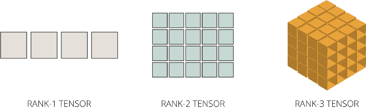
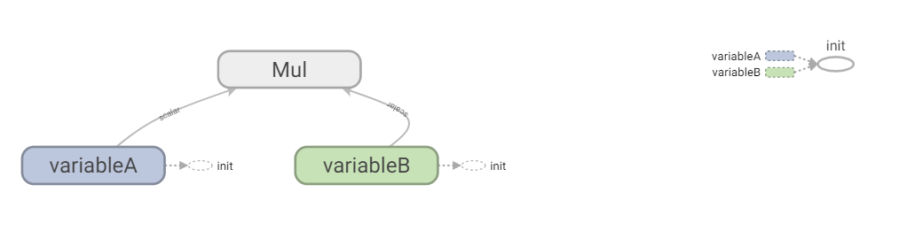
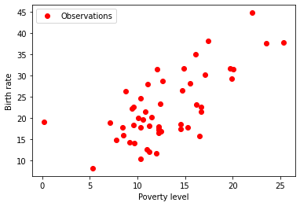

# Basic machine learning models with TensorFlow

## Getting started

Questo tutorial presuppone una conoscenza di base di Python 3 e un certo grado di familiarità con l'algebra lineare.

## What is Machine Learning?

Machine Learning is one of the fields of artificial intelligence and identifies the development of automatic learning systems capable to improve their own performance in a given task through experience. The applications of Machine Learning are the most varied and regard, to cite only a few examples, speech recognition, computer vision including autonomous driving cars, the classificiation of new astronomical structures exploited, for example, by NASA to automatically classify the celestial bodies in the sky surveys and the data-mining. 

### Classification of the Machine Learning algorithms

Machine Learning algorithms are typically divided in three main categories, depending on the type of learning used to contruct a forecast model.

  - *Supervised Learning*: the computer is trained by a learning set in which each input element is made up by a set of attributes to which an output value, called label, is attached. The output value represents the result associated to the corresponding input element. Once performed the training phase and built up the forecast model, the performance of the approach can be assessed by a testing phase in which the algorithm is applied to test data and the forecast results are compared to the "ground-truth" results.
  - *Unsupervised Learning*: in this case, no label is associated to the input data and the only way the algorithm has to construct a model is analyzing the input data and organize them on the basis of common features. Such an approach can be used either to highlight models hidden within the data or to return forecasts.
  - *Reinforced Learning*: by this approach, the program interacts with a dynamic environment from which it receives feedbacks according to the correctness of the performed action choices. The system receives a prize if the choice is right, while it receives a penalty if the choice is wrong.

A different division can be performed depending on the desired output. For supervised learning, we have different approaches, among which:

  - *Classification*: in the case of classifiers, the inputs are subdivided into two or more classes and the algorithm must return a model capable to assign possible new elements to one of these classes.
  - *Regression*: in the case of regression, the outputs are numerical results, rather than classes.


## What is TensorFlow?

TensorFlow is an open source library used in machine learning.

It has been developed by Google in the framework of the Google Brain (AI) project and, in 2015, its code has been released with an open source license.

Today, TensorFlow is used in many areas of science and industry for machine learning applications and, more generally, for artificial intelligence. For example, Google uses TensorFlow for image recognition algorithms and in its own RankBrain algorithm developed and used by its search engine to interpret the meaning of a query. Moreover, TensorFlow is often employed for reading handwritten text and for the automatic recognition of objects or people. Generally speaking, TensorFlow is routinely adopted in commercial or research developments to create and distribute automatic learning modules. In few years, it has evolved from a simple library to a whole ecosystem for all types of machine learning.

The name TensorFlow is composed by the two words “tensor” and “flow”. The use of “tensor” is due to the fact that a tensor is an algebraic object that describes a multilinear relationship between sets of algebraic objects related to a vector space, that such algebraic objects are often described by multidimensional matrices and that TensorFlow is based on the manipulation of multidimensional matrices. The word “flow” evokes the operations flow.

TensorFlow is compatible with Windows, Linux, MaxOS, Raspbian and Android. It can be used under Python, C, Java, Go and Rust. At this [link](https://www.tensorflow.org/install), the installation instructions can be found along with the versions of the operating systems and of Python with which TensorFlow is compatible. TensorFlow is already installed under Google Colab and there is nothing simpler than using it under such a service.

TensorFlow runs on both CPUs and GPUs. Nevertheless, it must be mentioned that, since 2016, Google has released a new Application Specific Integrated Circuit (ASIC) processor named Tensor Processing Unit (TPU) and purposely designed for AI applications that require TensorFlow. It is capable to accelerate machine learning processing and to execute TensorFlow operations much quicker as compared to a standard CPU. By Google Colab, it is possible to choose the desired computing platform among CPU, GPU and TPU.
Today, we have TensorFlow `2.6.1` which dramatically simplifies the coding as compared to TensorFlow `1.x`. 

Enabling the execution on heterogeneous devices allows to develop an application and to execute it on the same development machine, typically with a reduced dataset, and later to transfer it, without altering the code, on a more powerful system or on a mobile device, if enough powerful, or on a cloud service benefitting of a potentially unlimited computing capabilities and making available CPUs, GPUs, TPUs and Microsoft Azure FPGAs.

### Lazy and eager evaluations

One of the most relevant differences between TensorFlow `1.x` and TensorFlow `2.x` is the default execution modality: TensorFlow `1.x` adopts the *eager* evaluation while TensorFlow `2.x` uses the *lazy* evaluation. But what is the difference between the two?

A programming language like Python implements the eager execution model. In other words, the operations are executed immediately as they are called. From the User's point of view, this has the advantage of simplfying the debugging since pieces of code can be easily integrated in tools for error check or simply the content of variables can be controlled in a direct way.

Opposite to that, by the lazy evaluation, the operations are not executed at the point in which they are invoked, but they are exploited to create a computational graph, as illustrated in the following Fig. [1](#computationalGraph)

<p align="center">
  
  <br>
     <em>Figure 1. Computational graph illustrating the  operation.</em>
</p>

This, obviously, complicates the debugging phase since, opposite to the eager modality, it is not possible, for example, to follow the content of the variables during the execution. The lazy evaluation has however the following advantages:

  - *Parallelism*. By the computational graph, spotting the parallelizable portions of the code is simpler.
  - *Distributed execution*. By the computational graph, automatically distributing the execution of portions of the code among different devices (CPUs, GPUs and TPUs in the cases of our interest), possibly installed on different machines, is simpler.
  - *Compilation*. The computational graph can be used to generate a faster code since it can lead to “simplifications” or fusions of adjacent operations.
  - *Portability*. The computational graph is language and platform-independent which favors portability.

Using lazy execution was cumbersome in TensorFlow `1.x` since it required the use of proper *sessions*. Now this is not necessary anymore, since, as mentioned, lazy execution is the default computational modality for TensorFlow `2.x`. Of course, it is possible to manually switch to eager computation in TensorFlow `2.x` too.

Once clarified the meaning of lazy and eager evaluations in TensorFlow, let us spend some words on *automatic differentiation* for the automatic computation of the derivatives of a multidimensional function. Automatic differentiation, indeed, is a crucial technique in many machine and deep learning applications.

### Automatic differentiation

To illustrate automatic differentiation in a simple way [\[1\]](#AUTODIFF), let us suppose to compute the partial derivatives of a function , where  and  are the independent variables and function 
could represent, for example, the output of a *cost function* as it will be clearer in the following. Our purpose is to “automatically” compute the partial derivatives of , namely,  and . Many possibilities exist.

The first consists into resorting to a finite difference approximation of the derivatives, as done in [Problem solving with PyCUDA](https://vitalitylearning2021.github.io/problemSolvingPyCUDA/). However, finite differencing must be performed with care to avoid numerical errors which can easily become much relevant. 

The second is using a symbolic differentiation tool, as those available in Matlab or WolframAlpha. Nevertheless, also symbolic differentiation must be used with care since the size of the result can be much larger than the minimum required.

A third possibility is to regard the expression to differentiate as a series of elementary operations that can be implemented by any programming language. On applying the differentiation rules to each individual elementary operation, we can obtain a code enabling the numerical computation of the derivatives. To better clarify the idea, let us suppose that the expression of  is the following:

<p align="center">
         [1]
</p>

In this case, the elementary operations that can be isolated are:

<p align="center">
        [2]
</p>

These operations correspond to the following graph:

<p align="center">
  
  <br>
     <em>Figure 2. Computational graph for the automatic differentiation example.</em>
</p>

The first two operations are meant as assignment operations. The graph in Fig. [2](#computationalGraphAutodiff) is the same graph that TensorFlow would internally build up for the lazy execution.

Let us suppose now to compute  using the so-called *forward mode automatic differentiation*. By such a technique, the calculations begin from the innermost function and proceed with the derivatives towards the outermost functions. In the case at hand, the forward mode automatic differentiation would perform the following computations paired with respect to those in [\[2\]](#elementaryOperationsAutomaticDiff):

  - the first operation would be to compute the derivative of  with respect to , namely , which leads to  as result;
  - the second operation would be to compute the derivative of  with respect to , namely, , which leads to  as result, being  independent from ;
  - furthermore, we would need to compute the derivative of  with respect to , namely, ; the result would be  since we are differentiating a constant multiplied by a function;
  - as fourth step, we would need to compute ; this corresponds to  which returns , according to the previous steps;
  - as penultimate step, we would need to compute ; by the *chain rule*, we would obtain ; we could exploit the result at the previous step to evaluate ;
  - finally, the last step would consist of computing ; using the chain rule again, we would obtain .

As it can be seen, at each step, the computed derivatives depend only on the derivatives at the previous steps. By comparing the above operations with the graph in Fig. [2](#computationalGraphAutodiff), we can see that the operations corresponding to each node depend only on those of the nodes immediately upstream on the graph. Thanks to that, we can express the computation of the partial derivative with respect to  as the following sequence of operations

<p align="center">
        [3]
</p>

By forward substitution in the last equation of the eqs. [\[3\]](#elementaryOperationsAutomaticDiffDerivative), the derivative of interest remains computed. Given that, the procedure to compute  is totally analogous.

It should be noticed that the forward mode automatic differentiation is effective when the functions of which computing the derivatives have few inputs and many outputs. Opposite to that, in machine learning applications, as it will be seen, the functions have tipically different inputs and only one output.

An alternative to forward mode automatic differentiation, which is used by almost all the machine learning and deep learning tools, is called *reverse mode automatic differentiation* and consists of traversing the graph in a reversed order. To clarify this point, let us consider again eqs. [\[2\]](#elementaryOperationsAutomaticDiff) and suppose that we want to compute . Thanks to the chain rule, we can compute  as

<p align="center">
         [4]
</p>

Reconsidering eqs. [\[2\]](#elementaryOperationsAutomaticDiff) in a reverse way, we have

<p align="center">
        [5]
</p>

By substituting eqs. [\[5\]](#elementaryOperationsAutomaticDiffDerivativeReverse) in [\[2\]](#elementaryOperationsAutomaticDiff), the partial derivative of interest remains computed.

## “Hello World” in TensorFlow

Let us present the first, simple, classical example employing TensorFlow:

``` python
import tensorflow as tf

print(tf.__version__)

message = tf.constant('Hello World')

print(message)

tf.print(message)
```

The Listing is much simple to be read. The first instruction performs the import of the TensorFlow library, while the second shows the version, `2.7.0` at the time of writing. Then, a constant tensor, namely, an immutable sensor, of string type, is defined which has `Hello World` as value. 

The last two instructions perform the printout of the tensor. The first `print` uses a Python function and the printout consists of just the properties of the `message` object. Indeed, the printout is

``` python
tf.Tensor(b'Hello World', shape=(), dtype=string)
```

It informs us that the `message` object is a TensorFlow tensor, having the value `Hello World`, of undefined `shape` and of `string` type. If we want to print out the only value of a tensor, then we need the TensorFlow primitive `tf.print`.

## Basic operations in TensorFlow

Internamente, Tensorflow rappresenta i tensor come array -dimensionali di *datatypes* base (`int`, `string`, etc..). Il datatype di un tensore è sempre noto in qualsiasi momento dell'esecuzione del codice ed è condiviso da tutti gli elementi del tensore. Nella modalità di esecuzione lazy, la *shape* di un tensore, ossia il numero di dimensioni e la lunghezza di ogni dimensione, può invece essere anche solo parzialmente nota. Questo avviene perché le operazioni in un grafo producono tensori di dimensioni full-known solo se quelle degli input sono altrettanto conosciute. Dunque, spesso è possibile determinare la shape finale di un tensore solo al termine dell’esecuzione dei grafi. Il *rank* di un tensor è infine il numero di sue dimensioni. Datatype, shape and rank rappresentano le tre caratteristiche fondamentali di un tensore. Tutti i tensori hanno anche una dimensione, che è il numero totale di elementi al loro interno. Come si vede, i tensori di TensorFlow sono simili agli array della libreria NumPy.

Nel seguito, mostreremo semplici esempi con difficoltà incrementale. The import of the TensorFlow library

``` python
import tensorflow as tf
```

will be always assumed and suppressed.

### Tensori monodimensionali costanti

Facciamo un primo semplice esempio di tensore monodimensionale costante il cui prototipo generale è

``` python
tf.constant(
   value, dtype=None, shape=None, name='Const'
)
```

Nell'esempio che segue, si creano due tensori monodimensionali costanti a partire da liste dei loro elementi. Il primo è un tensore di stringhe, mentre il secondo è un tensore di numeri razionali

``` python
instruments       = tf.constant(["Violin", "Piano"], tf.string)
rationalNumbers   = tf.constant([1.223, 2.131, -10.43], tf.float32)

print("`instruments` is a {}-d Tensor with shape: {}".format(tf.rank(instruments).numpy(), tf.shape(instruments)))
print("`rationalNumbers` is a {}-d Tensor with shape: {}".format(tf.rank(rationalNumbers).numpy(), tf.shape(rationalNumbers)))
```

### Tensori -dimensionali costanti

Nelle tipiche applicazioni di TensorFlow (e.g., image processing or computer vision), può essere necessario gestire anche immagini 2d o 3d o sequenze di immagini 2d o 3d. Da questo punto di vista, può essere necessario riuscire a gestire anche 4d tensor. Nell'esempio riportato di seguito, si definisce un 4d constant tensor doppia precisione per gestire 3 immagini 128 x 128 x 16. 

``` python
images = tf.constant(tf.zeros((3, 128, 128, 16), tf.float64, "4d constant tensor definition"))

assert isinstance(images, tf.Tensor), "Matrix must be a TensorFlow tensor object"
assert tf.rank(images).numpy() == 4, "Matrix must be of rank 4"
assert tf.shape(images).numpy().tolist() == [3, 128, 128, 16], "Matrix has incorrect shape"
```

Per attivare gli assert, è necessario modificare o la natura dell'oggetto, o il rank oppure lo shape.

Un tensore -dimensionale può anche essere costruito a partire da una lista -dimensionale, come nell'esempio seguente

``` python
threeDimensionalList = [[[0, 1, 2], 
                         [3, 4, 5]], 
                        [[6, 7, 8], 
                         [9, 10, 11]]]
rank3Tensor = tf.constant(threeDimensionalList)
print(rank3Tensor)
print("The number tensor dimensions is", rank3Tensor.ndim)
print("The tensor shape is", rank3Tensor.shape)
print("The tensor data type is", rank3Tensor.dtype)
print("The tensor size is", tf.size(rank3Tensor).numpy())
```

Nell'esempio di sopra, vengono anche `print`-ed the number of dimensions, the shape, the data type and the size of the tensor. La size indica il numero totale di elementi di un tensore. Come si può vedere, non è possibile to `print` the size con un attributo dell'oggetto tensore. Invece, è necessario usare la funzione `tf.size()` e convertire il suo output con la funzione di istanza `.numpy()` per ottenere un risultato più leggibile.

<p align="center">
  
  <br>
     <em>Figure 3. Tensor rank.</em>
</p>

### Indexing

TensorFlow segue anche le regole di indicizzazione Python standard.

``` python
aList = [0, 1, 2, 3, 4, 5, 6, 7, 8, 9, 10, 11]
aTensor = tf.constant(aList)

print("The first element is:", aTensor[0].numpy())
print("The last element is:", aTensor[-1].numpy())
print("Elements in between the first and the last:", aTensor[1 : -1].numpy())
```

Nell'esempio sopra riportato, si può notare che:

  - gli indici iniziano da zero (`0`);
  - il valore dell'indice negativo (`-n`) indica il conteggio all'indietro dalla fine;
  - the colon syntax (`:`) is used to slide: `start : stop : step`.
  - not shown in the example above, but the comma syntax (`,`) vengono utilizzate per raggiungere livelli più profondi.

### Basic operations

Nell'esempio che segue, si mostra come si possano eseguire operazioni matematiche di base su tensori come addizione, elementwise multiplication, matrix multiplication e determinare il massimo o l'indice di massimo di un tensore.

``` python
a = tf.constant([[3, 2], [-10, 7]], dtype=tf.float32)
b = tf.constant([[0, 2], [  6, 1]], dtype=tf.float32)

addingTensors         = tf.add(a, b)
multiplyingTensors    = tf.multiply(a, b)
matrixMultiplication  = tf.matmul(a, b)
tf.print(addingTensors)
tf.print(multiplyingTensors)
tf.print(matrixMultiplication)

print("The maximum value of b is:", tf.reduce_max(b).numpy())
print("The index position of the maximum element of b is:", tf.argmax(b).numpy())
```

### Reshaping

Proprio come negli array NumPy, è possibile effettuare il reshaping di oggetti TensorFlow. L'operazione `tf.reshape()` è molto veloce poiché i dati sottostanti non devono essere elaborati, ma solo i parametri che descrivono le dimensioni modificati. 

``` python
a = tf.constant([[1, 2, 3, 4, 5, 6]])
print('Initial shape:', a.shape)

b = tf.reshape(a, [6, 1])
print('First reshaping:', b.shape)

c = tf.reshape(a, [3, 2])
print('Second reshaping:', c.shape)

# --- Flattening
print('Flattening:', tf.reshape(a, [-1]))
```

### Operator overload

Quando eseguiamo operazioni tra tensori di dimensioni diverse, la differenza delle dimensioni può essere gestita automaticamente da TensorFlow tramite opportuni overload delle operazioni in questione, esattamente come in NumPy. Ad esempio, quando si tenta di moltiplicare un tensore scalare con un tensore di rango `2`, ogni elemento tensore di rango `2` viene moltiplicato per lo scalare, come nell'esempio che segue:

``` python
m = tf.constant([5])

n = tf.constant([[1, 2], [3, 4]])

tf.print(tf.multiply(m, n))
```

### Irregular tensors

Generalmente, i tensori di interesse hanno forma rettangolare. Tuttavia, TensorFlow supporta anche tipi di tensori irregolari come:

  - ragged tensors,
  - string tensors,
  - sparse tensors.

<p align="center">
  
  <br>
     <em>Figure 4. Irregular tensor.</em>
</p>

#### Ragged tensors

I ragged tensors sono tensori con un numero diverso di elementi lungo le varie dimensioni, come mostrato in Fig. [3](#irregularTensors). Un ragged tensor può essere costruito come segue:

``` python
raggedList = [[1, 2, 3], [4, 5], [6]]

raggedTensor = tf.ragged.constant(raggedList)

tf.print(raggedTensor)
```

#### String tensors

I tensori stringa sono tensori che memorizzano gli oggetti stringa. Possiamo costruire un tensore stringa come un normale oggetto tensore passando oggetti stringa come elementi al posto di oggetti numerici, come mostrato di seguito:

``` python
stringTensor = tf.constant(["I like", 
                            "TensorFlow", 
                            "very much"])

tf.print(stringTensor)
```

#### Sparse tensors

Quando molti degli elementi di un tensore sono nulli anzicché diversi da zero, è conveniente utilizzare tensori sparsi. Essi si costruiscono indicando solo gli elementi non nulli e la loro posizione all'interno del tensore:

``` python
sparseTensor = tf.sparse.SparseTensor(indices      = [[0, 0], [2, 2], [4, 4]], 
                                      values       = [25, 50, 100], 
                                      dense_shape  = [5, 5])

tf.print(sparseTensor)
tf.print(tf.sparse.to_dense(sparseTensor))
```

#### Variable tensors

Una variabile è un oggetto di TensorFlow che è possibile manipolare. Essa è registrata come `tf.Variable` e può essere aggiornata, ad esempio, con la funzione `tf.assign()`. 

Così come per gli oggetti visti in precedenza, la forma di un oggetto `tf.Variable` può essere modificata con la funzione `tf.reshape()` e un oggetto `tf.Variable` ha attributi come `.shape` e `.dtype`. Tuttavia, le variabili hanno anche caratteristiche uniche come `.trainable`, `.device` e `.name`.

``` python
constantA = tf.constant([[0.0, 1.0],
                         [2.0, 3.0]])
variableA = tf.Variable(constantA, name = "variableAName")
tf.print(variableA)

variableB = tf.Variable(1000)
tf.print(variableB)

listC = [[0.0, 1.0],
         [2.0, 3.0]]
variableC = tf.Variable(listC)
tf.print(variableC)

variableD = tf.Variable("Sample string")
tf.print(variableD)

stringListE = ["I like", "TensorFlow", "very much"]
variableE   = tf.Variable(stringListE)
tf.print(variableE)
```

Nell'esempio di sopra, si mostra come sia possibile inizializzare una `tf.Variable` con un `tf.constant`, un singolo `int`, un elenco di `float`, una singola `string` o un elenco di `string`. Ogni variabile deve essere opportunamente inizializzata, altrimenti TensorFlow genera un messaggio di errore. Durante la loro creazione, alle variabili può essere anche assegnato un nome, la cui utilità sarà maggiormente chiara nel seguito. Se non si specifica un nome, TensorFlow assegna un nome predefinito.

Nell'esempio di sotto, si mostra come, per poter visualizzare i valori di una variabile, possano utilizzare le funzioni `.value()` e `.numpy()`. Si mostra anche come, durante la creazione della variabile, le si possa assegnare un nome la cui utilità sarà chiara di sotto. Se non si specifica un nome, TensorFlow assegna un nome predefinito. L'esempio illustra anche le altre proprietà di una variabile analoghe a quelle già discusse per il caso `tf.constant`.

``` python
print("Values stored in variableA: \n", variableA.value())
print("Values stored in variableA: \n", variableA.numpy())
tf.print("Values stored in variableA: \n", variableA.value())

print("Variable name: ", variableA.name)

print("Datatype of variableA: ", variableA.dtype)

print("Shape of variableA: ", variableA.shape)

print("Number of dimensions of variableA:", tf.rank(variableA).numpy())

print("Number of elements of variableA:", tf.size(variableA).numpy())
```

Le operazioni di base che è possibile eseguire con le funzioni di TensorFlow sono state già illustrate per il caso `tf.constant`. Oltre a ciò, si possono anche utilizzare gli operatori matematici. Inoltre, con `tf.assign()`, è possibile assegnare nuovi valori a un oggetto `tf.Variable` senza crearne uno nuovo. La possibilità di assegnare nuovi valori è appunto uno dei vantaggi delle variabili. Infine, proprio come per `tf.constant`, si può accedere facilmente a particolari elementi del tensore attraverso un opportuno indexing. L'esempio di seguito riassume queste considerazioni:

``` python
a = tf.Variable([[1.0, 2.0], [3.0, 4.0]])

tf.print("Addition by 2:\n", a + 2)
tf.print("Substraction by 2:\n", a - 2)
tf.print("Multiplication by 2:\n", a * 2)
tf.print("Division by 2:\n", a / 2)
tf.print("Matmul operation with itself:\n", a @ a)
tf.print("Modulo operation by 2:\n", a % 2)

a.assign(([[3, 20], [-2, 110]]))
tf.print(a)

print("The 1st element of the first level is:", a[0].numpy())
print("The 2nd element of the first level is:", a[1].numpy())
print("The 1st element of the second level is:", a[0, 0].numpy())
print("The 3rd element of the second level is:", a[0, 1].numpy())
```

L'operator overload esiste anche per gli oggetti `tf.Variable` così come visto per gli oggetti `tf.constant`:

``` python
b = tf.Variable([5])
c = tf.Variable([[1, 2], [3, 4]])
tf.print(b * c)
```

E' possibile effettuare il reshape di una `tf.Variable`:

``` python
a = tf.Variable([[1.0, 2.0], [1.0, 2.0]])

tf.print(tf.reshape(a, (4, 1)))
```

Infine, è possibile accelerare il processing con GPU e TPU e verificare con quale tipo di processore viene elaborata la nostra variabile tramite l'attributo `.device`:

``` python
print("Device processing variable a:\n", a.device)

with tf.device('CPU:0'):
  a = tf.Variable([[1.0, 2.0, 3.0], [4.0, 5.0, 6.0]])
  b = tf.Variable([[1.0, 2.0, 3.0]])
  print("Device processing variable a:\n", a.device)
  print("Device processing variable b:\n", b.device)

with tf.device('GPU:0'):
  # Element-wise multiply
  k = a * b
  print("Device processing the calculation:\n", k.device)
```

Con riferimento al codice precedente, per farlo funzionare come inteso e se si sta utilizzando Google Colab, è necessario cambiare il tipo di runtime to GPU.

### Disabling and enabling the eager execution

As already mentioned, eager execution means that le operazioni vengono eseguite passo passo, semplificando la fase di debug. Tuttavia, la eager execution previene una serie di accelerazioni altrimenti disponibili. Fortunatamente, c'è la possibilità di disabilitare la eager execution.

Possiamo innanzitutto verificare che la eager execution è il modello di esecuzione di default:

``` python
tf.executing_eagerly()
tf.compat.v1.disable_eager_execution()
```

Le righe di sopra verificano se la eager execution è il modello di esecuzione attivo e, successivamente, la disabilitano.

### Nodes, edges and TensorBoard

Come menzionato precedentemente, al centro di TensorFlow c'è il concetto di grafo. Tuttavia, come si esamina un grafo una volta che è stato creato? E' possibile usare uno strumento noto come Tensorboard. Questo è uno strumento integrato con TensorFlow `2.x` e può essere utilizzato per visualizzare un grafo. Di seguito, un semplice esempio di uso di TensorBoard. L'esempio è stato conceived per essere eseguito su Google Colab e presuppone l'aver disabilitato la eager execution, come nell'esempio precedente. Come si vede, il codice è costruito nell'ambito della lazy execution e definisce un grafo che descrive le strutture dati e le loro operazioni, ma non contiene dati. 

``` python
%load_ext tensorboard
tf.compat.v1.reset_default_graph()

a = tf.Variable(5, name='variableA')
b = tf.Variable(6, name='variableB')
c = tf.multiply(a, b, name='Mul')

sess = tf.compat.v1.Session()
sess.run(tf.compat.v1.global_variables_initializer())

writer = tf.compat.v1.summary.FileWriter('./graphs', graph=sess.graph)

print(sess.run(c)) 

writer.flush()
writer.close()
%tensorboard --logdir='./graphs'
```

Il grafo consiste nella creazione di due variabili, `a` e `b`, e nella loro moltiplicazione e viene mostrato di seguito.

<p align="center">
  
  <br>
     <em>Figure 5. Simple graph using TensorBoard.</em>
</p>

Ora si può comprendere l'utilità di assegnare un nome alle variabili. In particolare, alle variabili  `a` e `b` vengono assegnati i nomi di `variableA` e `variableB`, respectively. Come si vede, viene assegnato un nome anche all'operazione di moltiplicazione che viene indicata come `Mul`. I nomi assegnati sono chiaramente visibili nel grafo in Figure [5](#simpleTensorBoard).

### Are TensorFlow constants really constant?

Se proviamo ad eseguire l'operazione

``` python
a = tf.constant(2)
a = a + 1
```

e poi stampiamo il risultato con

``` python
tf.print(a)
```

ci accorgeremo che il risultato è `3`. Questo ci fa chiedere se i tensori costanti in TensorFlow siano davvero costanti.

In realtà, quando scriviamo

``` python
a = tf.constant(2)
```

definiamo `a` come una variabile di Python that holds a constant node of the computational graph. Let us call it `constant:0`. Quando scriviamo

``` python
a = a + 1
```

since the assignment is a destructive operation, `a` is a new Python variable that holds the add operation between the `constant:0` node that is still defined in the graph and a new constant node, automatically created when using `1.0`.

## Linear regression with TensorFlow

Linear regression falls into the broad category of supervised learning and is a simple and commonly used machine learning algorithm. It is thus a good starting point to illustrate how TensorFlow can be used in this field. We will sum up first the cornerstones of the approach and, later on, we will walk through its TensorFlow implementation.

### Linear regression: Theory

Linear regression models the relation of independent and dependent variables by linear equations. Let us begin by dealing with a one-dimensional problem and let us suppose to have at our disposal a certain number of experimental measurements of a certain phenomenon. For example, let us consider observations reporting the birth rate as a function of the poverty level, see figure below:

<p align="center">
  
  <br>
     <em>Figure 5. Observation of birth rates against poverty level.</em>
</p>

In particular, Figure [5](#LinearRegressionData) reports, on the  axis, the poverty level for each of the  states of USA in addition to the District of Columbia, evaluated for the year  and measured as the percentage of each state's population living in households with incomes below the federally defined poverty level. Moreover, figure [5](#LinearRegressionData) reports, on the  axis, the birth rate, for the year , for  females  to  years old. From figure [5](#LinearRegressionData), it can be understood how the link between birth rate and poverty level can be approximated as linear. In other words, the relation between the dependent  variable  and the independent variable  can be evaluated as

<p align="center">
   [6]
</p>

where  is the slope and  the intercept with the  axis. Once established the approximation in equation [\[6\]](#linearRegression), the line can be used to perform forecasts. In other words, whenever one is interested into estimating the birth rate corresponding to a certain poverty level  not present in the scatter plot, an estimate of the birth rate can be achieved as .

In order to approximate the scatter plot with a line, a measure of the fidelity of the approximation must be introduced first and, afterwards, the values of  and  corresponding to the best approximation must be computed.

There are many measures of the goodness of our prediction, the most popular one being the *mean squared error* (MSE)

<p align="center">
   [7]
</p>

dove  is the number of experimental measurements corresponding to the scatter plot ( for the example under examination), the 's are the experimental observations and the 's are the values returned by the model, namely, , where the 's are the observed poverty levels. Functions like the one in equation [\[7\]](#MSELinearRegression) are called *loss functions* or *objective functions*.

On using the measure in equation [\[7\]](#MSELinearRegression), linear regression consists of determining the values of  and  minimizing the MSE. The search for the “optimal” parameters, namely, those minimizing , can be iteratively performed using a loop that, following initial guesses for  and , essentially performs two main operations:

  - measure the goodness of the fit based on equation [\[7\]](#MSELinearRegression);
  - adjust the unknown parameters.

The operations in the loop are repeated until the MSE “looks good”.

In more detail, the adjustment, or update, of the unknown parameters can be operated using methods based on the gradient of the functional [\[7\]](#MSELinearRegression). Among various optimization algorithms based on the gradient, in the following, we will use the so called *gradient descent* which is very used in approaches of artificial intelligence and so it is useful to know. On denoting with  the unknowns vector, the gradient descent updates the unknowns according to the following rule

<p align="center">
   [9]
</p>

where  represents the value of the unknowns at the current step,  represents the updated unknowns vector,  is the value of the gradient at the current step and  is the so-called *learning rate*. The learning rate is a parameter chosen by the user and represents how large the change of the unknowns vector must be for having a non-vanishing gradient.

The iterations can be stopped using different stopping criteria. For example:

  - the algorithm is terminated once a specified number of iterations is reached;
  - the algorithm once a specified maximum MSE is satisfied;
  - the algorithm is terminated if the MSE does not decrease in the next iteration; for example, if the difference between two successive MSEs is less than , then the algorithm is stopped.

In the case when the observations are not one-dimensional, but multi-dimensional, the experimental observation become vectors  and model [\[6\]](#linearRegression) becomes

<p align="center">
   [10]
</p>

dove  is the vector of independent parameters,  is the coefficients matrix,  is the offset vector and  is the vector of the dependent variables. 

In next subsection, we will see how it is possible to put the exposed theory into practice using TensorFlow `2.x`.

### Linear regression: Practice

Starting to discuss about the code, the first performed operations are the `import`s:

``` python
import tensorflow as tf
import numpy as np

import matplotlib.pyplot as plt
```
<p align="center" id="xxx" >
     <em>Listing 1. Imports for the linear regression code.</em>
</p>

The TensorFlow library is imported as `tf`, while we do not have anything to add concerning the other `import`s besides what already said.

The next operation is giving a name to the `numpy` library to handle random numbers, namely

``` python
rng = np.random
```

Next step is defining the parameters of the simulation, namely, the learning rate `alpha`, the number of iterations `numIter` and `skipIter`. The idea behind `skipIter` is to outputting the simulation state in terms of current interation number, cost function and current values of the unknowns every `skipIter` iterations:

``` python
alpha     = 0.0001  
numIter   = 1000    
skipIter  = 50      
```
<p align="center" id="xxx" >
     <em>Listing 2. Optimization parameters for the linear regression code.</em>
</p>

At this point, we need to define the training dataset, namely, the couples “poverty level” (`X`) - “birth rate” (`Y`):

``` python
X = np.array([20.1, 7.1, 16.1, 14.9, 16.7, 8.8, 9.7, 10.3, 22, 16.2, 12.1, 10.3, 14.5, 12.4, 9.6, 12.2, 10.8, 14.7, 19.7, 11.2,	
              10.1, 11, 12.2, 9.2, 23.5, 9.4, 15.3, 9.6, 11.1, 5.3, 7.8, 25.3, 16.5, 12.6, 12, 11.5, 17.1, 11.2, 12.2, 10.6, 19.9, 
              14.5, 15.5, 17.4, 8.4, 10.3, 0.2, 12.5, 16.7, 8.5, 12.2	])
Y = np.array([31.5, 18.9, 35, 31.6, 22.6, 26.2, 14.1, 24.7, 44.8, 23.2, 31.4, 17.7, 18.4, 23.4, 22.6, 16.4, 21.4, 26.5, 31.7, 11.9, 
              20, 12.5, 18, 14.2, 37.6, 22.2, 17.8, 18.3, 28, 8.1, 14.7, 37.8, 15.7, 28.6, 11.7, 20.1, 30.1, 18.2, 17.2, 19.6, 29.2, 
              17.3, 28.2, 38.2, 17.8, 10.4, 19, 16.8, 21.5, 15.9, 17.7	])
```

These data have been taken from [\[2\]](#MIND_ON_STATISTICS). Subsequently, two TensorFlow variables are defined, namely, `m` and `b` and initialized with random values using a Gaussian distribution with zero mean and variance `1`. These variables will be appointed to store the current values of the unknowns:

``` python
m = tf.Variable(rng.randn())
b = tf.Variable(rng.randn())
```
<p align="center" id="xxx" >
     <em>Listing 3. Unknown variables definition for the linear regression algorithm.</em>
</p>

Now we need to define two functions. The first function represents the linear model [\[6\]](#linearRegression), that is,

``` python
def linearModel(x):
    return m * x + b
```
<p align="center" id="xxx" >
     <em>Listing 4. Linear model for linear regression.</em>
</p>

The second represents functional [\[7\]](#MSELinearRegression), namely

``` python
def costFunction(y_model, y_data):
    return tf.reduce_mean(tf.square(y_model - y_data))
```
<p align="center" id="xxx" >
     <em>Listing 5. Cost functional for linear regression.</em>
</p>

Following the definition of the two functions implementing linear regression, the optimizer is defined as *stochastic gradient descent* with a learning rate equal to `alpha`:

``` python
optimizer = tf.optimizers.SGD(alpha)
```
<p align="center" id="xxx" >
     <em>Listing 6. Setting the optimizer for the linear regression method.</em>
</p>


<p align="center">
  , [6]
</p>


Ritorneremo successivamente sull'uso di TensorBoard quando costruiremo i primi esempi di learning con TensorFlow.


#### Placeholders

https://learntutorials.net/it/tensorflow/topic/2952/segnaposto


### Prossimo paragrafo

Stiamo vedendo questo


### TensorBoard

Qui si può spiegare perché le variabili constanti apparentemente possono essere modificate

https://stackoverflow.com/questions/46786463/modifying-tensorflow-constant-tensor

https://www.intelligenzaartificialeitalia.net/post/tutorial-pratico-tensorflow-tensorboard-e-python-per-capire-come-funzionano-le-reti-neurali

https://newstecnologiche.altervista.org/esercitazione-su-tensorboard/

https://ichi.pro/it/una-guida-rapida-a-tensorboard-276092819192783

https://ichi.pro/it/introduzione-a-tensorflow-2-0-275931290659758

Un grafo è la rappresentazione, per mezzo di nodi, di operazioni eseguite sui tensori.


Per comprendere il flow dei dati e delle operazioni in Tensorflow, possiamo servirci dei grafi, rappresentazioni convenienti di computazioni.

Un grafo, o graph, e sarà quindi costituito da tensori, che gestiranno i dati, e dalle operazioni compiuti su di essi.


https://ichi.pro/it/tutorial-su-tensorflow-una-guida-completa-all-apprendimento-approfondito-con-tensorflow-204595782052810
https://riptutorial.com/Download/tensorflow-it.pdf
https://vittoriomazzia.com/tensorflow-lite/
https://ichi.pro/it/guida-per-principianti-a-tensorflow-2-x-per-applicazioni-di-deep-learning-219815635385326

Variabili e costanti


https://www.it-swarm.it/it/python/variabili-e-costanti-tensorflow/833521263/


https://www.it-swarm.it/it/python/perche-denominiamo-le-variabili-tensorflow/1056840775/

https://pretagteam.com/question/in-tensorflow-what-is-the-difference-between-a-variable-and-a-tensor

https://people.unica.it/diegoreforgiato/files/2012/04/TesiNicolaPes.pdf

https://ichi.pro/it/padroneggiare-i-tensori-tensorflow-in-5-semplici-passaggi-59313927797638


Placeholder

https://www.it-swarm.it/it/tensorflow/qual-e-la-differenza-tra-tf.placeholder-e-tf.variable/824943616/

https://amslaurea.unibo.it/14173/1/tesi_piscaglia.pdf

Regressione lineare?
https://www.andreaminini.com/ai/tensorflow/esempio-tutorial-tensorflow

https://learntutorials.net/it/tensorflow/topic/856/iniziare-con-tensorflow

Semplice rete neurale?
https://andreaprovino.it/start-tensorflow-2-esempio-semplice-tutorial/
https://medium.com/@cosimo.iaia/machine-learning-tensorflow-per-luomo-di-strada-2c71a948b4e3
https://ichi.pro/it/introduzione-a-tensorflow-2-0-275931290659758
https://andreaprovino.it/tensorflow-guida-italiano-primi-passi-con-tensorflow/

%\section{Linear regression}
%http://www.ecostat.unical.it/Didattica/Statistica/didattica/StatAziendale2/StatAz2_cap2.pdf\\
%https://www.germanorossi.it/mi/file/disp/Regression.pdf\\
%http://www.dima.unige.it/~rogantin/ls_stat/N_scheda_5.pdf\\
%https://sanjayasubedi.com.np/deeplearning/tensorflow-2-linear-regression-from-scratch/\\
%https://towardsdatascience.com/get-started-with-tensorflow-2-0-and-linear-regression-29b5dbd65977

# REFERENCES
<p align="center" id="AUTODIFF" >
</p>
[1] A.G. Baydin, B.A. Pearlmutter, A.A. Radul, J.M. Siskind, "Automatic differentiation in machine learning: a survey," J. Machine Learn. Res., vol. 18, pp. 1-43, 2018.
<p align="center" id="MIND_ON_STATISTICS" >
</p>
[2] J.M. Utts, R.F. Heckard, "Mind on Statistics, Fifth Ed.," Cengage Learning, Stamford, CT, 2015.

