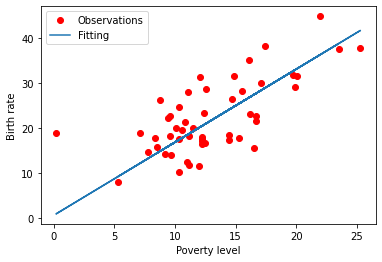
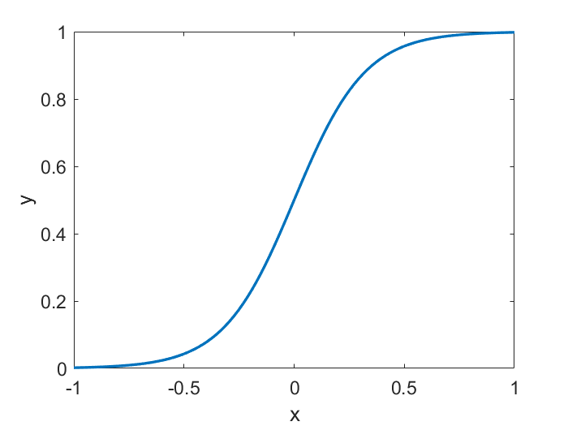
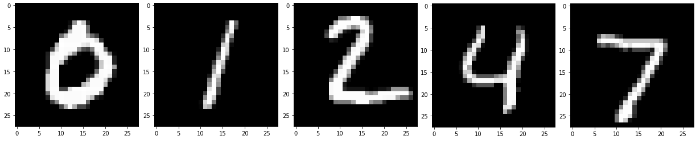
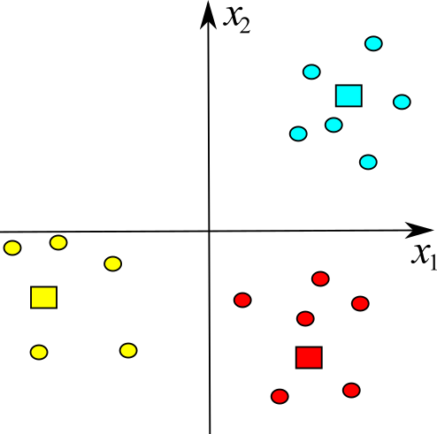
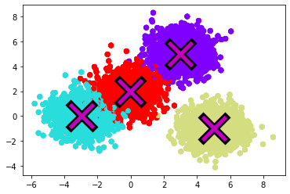
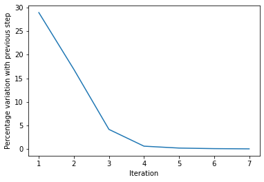
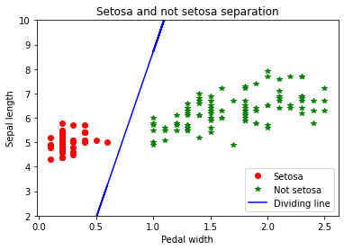
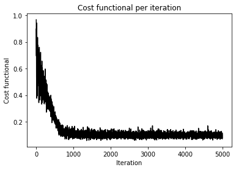
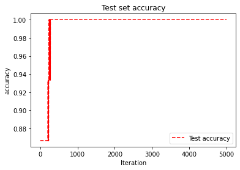

# Basic machine learning models with TensorFlow

<p align="center">
  
</p>

Despite machine learning is linked to computer science, its approaches are different to those of common programming practice. In the latter, the algorithm is conceived as a sequence of instructions executed by a computer to perform computations and solve problems. Machine learning algorithms, on the other side, enable a computer to train itself on a certain number of input data corresponding to a certain number of known situations and use the performed training to foresee outputs corresponding to situations that have not taken place. This becomes possible since machine learning constructs, from the input data, a model by which it develops an automatic system of answers or decisions.

Everyone of use benefits today of machine learning through technology, although often we don't realize it. The face recognition technology enables social media platforms to help the users in adding tags or in sharing pictures of friends of theirs. The Optical Character Recognition, or OCR, converts text images into character strings. The suggestion engines, implemented by machine learning, suggest which film or TV show to watch according to User's preferences. Self-driving cars, based on machine learning, are being tested to be launched on the market.

Machine learning is today a field of extreme timeliness and continuously evolving in which ever more complicated algorithms require computing platform ever more performing.

In this project, we present an introduction to the main machine learning methods, with reference to both supervised and unsupervised learning and to the simplest and most common approaches, as linear and logistic regression, the k-means algorithm, the nearest neighbor algorith and Support Vector Machine. More complex structures, as neural networks or deep neural networks will not be considered here for the sake of simplicity. Although conceptually simple, the presented algorithms, as linear regression, are powerful statistical techniques that can generate insights on consumer behavior, help to understand business better, and comprehend factors influencing profitability. They can also be employed to evaluate trends and forecast data in many fields. For example, we can use linear regression to solve a few of our daily problems related to supporting decision making, discovering new insights and creating predictive analytics. Likewise, logistic regression has become particularly popular in online advertisement enlabling the marketer to foresee, as percentage rate yes/not, the probability that specific users of specific websites click on specific advertisement banners.

Preparatory to machine learning techniques, the main features and programming tricks of the most popular open source library used in machine learning, namely, TensorFlow, will be illustrated, focusing the attention also on peculiar aspects of interest which is always convenient to known as lazy and eager evaluations and automatic differentiation.

In the present project, we will learn:

  - Machine learning;
  - TensorFlow 2.0;
  - Lazy and eager evaluations;
  - Automatic differentiation;
  - Linear regression;
  - Logistic regression;
  - K-Means;
  - Nearest neighbor;
  - Support Vector Machine (SVM);

## Getting started

The present project requires a basic knowledge of Python 3 and a certain degree of familiarity with linear algebra. All the mathematical aspects of the dealt with machine learning techniques will be provided for the project to be self-standing.

## What is Machine Learning?

Machine Learning is one of the fields of artificial intelligence and identifies the development of automatic learning systems capable to improve their own performance in a given task through experience. The applications of Machine Learning are the most varied and regard, to cite only a few examples, speech recognition, computer vision including autonomous driving cars, the classificiation of new astronomical structures exploited, for example, by NASA to automatically classify the celestial bodies in the sky surveys and the data-mining. 

### Classification of the Machine Learning algorithms

Machine Learning algorithms are typically divided in three main categories, depending on the type of learning used to contruct a forecast model.

  - *Supervised Learning*: the computer is trained by a learning set in which each input element is made up by a set of attributes to which an output value, called label, is attached. The output value represents the result associated to the corresponding input element. Once performed the training phase and built up the forecast model, the performance of the approach can be assessed by a testing phase in which the algorithm is applied to test data and the forecast results are compared to the "ground-truth" results.
  - *Unsupervised Learning*: in this case, no label is associated to the input data and the only way the algorithm has to construct a model is analyzing the input data and organize them on the basis of common features. Such an approach can be used either to highlight models hidden within the data or to return forecasts.
  - *Reinforced Learning*: by this approach, the program interacts with a dynamic environment from which it receives feedbacks according to the correctness of the performed action choices. The system receives a prize if the choice is right, while it receives a penalty if the choice is wrong.

A different division can be performed depending on the desired output. For supervised learning, we have different approaches, among which:

  - *Classification*: in the case of classifiers, the inputs are subdivided into two or more classes and the algorithm must return a model capable to assign possible new elements to one of these classes.
  - *Regression*: in the case of regression, the outputs are numerical results, rather than classes.


## What is TensorFlow?

TensorFlow is an open source library used in machine learning.

It has been developed by Google in the framework of the Google Brain (AI) project and, in 2015, its code has been released with an open source license.

Today, TensorFlow is used in many areas of science and industry for machine learning applications and, more generally, for artificial intelligence. For example, Google uses TensorFlow for image recognition algorithms and in its own RankBrain algorithm developed and used by its search engine to interpret the meaning of a query. Moreover, TensorFlow is often employed for reading handwritten text and for the automatic recognition of objects or people. Generally speaking, TensorFlow is routinely adopted in commercial or research developments to create and distribute automatic learning modules. In few years, it has evolved from a simple library to a whole ecosystem for all types of machine learning.

The name TensorFlow is composed by the two words “tensor” and “flow”. The use of “tensor” is due to the fact that a tensor is an algebraic object that describes a multilinear relationship between sets of algebraic objects related to a vector space, that such algebraic objects are often described by multidimensional matrices and that TensorFlow is based on the manipulation of multidimensional matrices. The word “flow” evokes the operations flow.

TensorFlow is compatible with Windows, Linux, MaxOS, Raspbian and Android. It can be used under Python, C, Java, Go and Rust. At this [link](https://www.tensorflow.org/install), the installation instructions can be found along with the versions of the operating systems and of Python with which TensorFlow is compatible. TensorFlow is already installed under Google Colab and there is nothing simpler than using it under such a service.

TensorFlow runs on both CPUs and GPUs. Nevertheless, it must be mentioned that, since 2016, Google has released a new Application Specific Integrated Circuit (ASIC) processor named Tensor Processing Unit (TPU) and purposely designed for AI applications that require TensorFlow. It is capable to accelerate machine learning processing and to execute TensorFlow operations much quicker as compared to a standard CPU. By Google Colab, it is possible to choose the desired computing platform among CPU, GPU and TPU.
Today, we have TensorFlow `2.6.1` which dramatically simplifies the coding as compared to TensorFlow `1.x`. 

Enabling the execution on heterogeneous devices allows to develop an application and to execute it on the same development machine, typically with a reduced dataset, and later to transfer it, without altering the code, on a more powerful system or on a mobile device, if enough powerful, or on a cloud service benefitting of a potentially unlimited computing capabilities and making available CPUs, GPUs, TPUs and Microsoft Azure FPGAs.

### Lazy and eager evaluations

One of the most relevant differences between TensorFlow `1.x` and TensorFlow `2.x` is the default execution modality: TensorFlow `1.x` adopts the *eager* evaluation while TensorFlow `2.x` uses the *lazy* evaluation. But what is the difference between the two?

A programming language like Python implements the eager execution model. In other words, the operations are executed immediately as they are called. From the User's point of view, this has the advantage of simplfying the debugging since pieces of code can be easily integrated in tools for error check or simply the content of variables can be controlled in a direct way.

Opposite to that, by the lazy evaluation, the operations are not executed at the point in which they are invoked, but they are exploited to create a computational graph, as illustrated in the following Fig. [1](#computationalGraph)

<p align="center">
  
  <br>
     <em>Figure 1. Computational graph illustrating the  operation.</em>
</p>

This, obviously, complicates the debugging phase since, opposite to the eager modality, it is not possible, for example, to follow the content of the variables during the execution. The lazy evaluation has however the following advantages:

  - *Parallelism*. By the computational graph, spotting the parallelizable portions of the code is simpler.
  - *Distributed execution*. By the computational graph, automatically distributing the execution of portions of the code among different devices (CPUs, GPUs and TPUs in the cases of our interest), possibly installed on different machines, is simpler.
  - *Compilation*. The computational graph can be used to generate a faster code since it can lead to “simplifications” or fusions of adjacent operations.
  - *Portability*. The computational graph is language and platform-independent which favors portability.

Using lazy execution was cumbersome in TensorFlow `1.x` since it required the use of proper *sessions*. Now this is not necessary anymore, since, as mentioned, lazy execution is the default computational modality for TensorFlow `2.x`. Of course, it is possible to manually switch to eager computation in TensorFlow `2.x` too.

Once clarified the meaning of lazy and eager evaluations in TensorFlow, let us spend some words on *automatic differentiation* for the automatic computation of the derivatives of a multidimensional function. Automatic differentiation, indeed, is a crucial technique in many machine and deep learning applications.

### Automatic differentiation

To illustrate automatic differentiation in a simple way [\[1\]](#AUTODIFF), let us suppose to compute the partial derivatives of a function , where  and  are the independent variables and function 
could represent, for example, the output of a *cost function* as it will be clearer in the following. Our purpose is to “automatically” compute the partial derivatives of , namely,  and . Many possibilities exist.

The first consists into resorting to a finite difference approximation of the derivatives, as done in [Problem solving with PyCUDA](https://vitalitylearning2021.github.io/problemSolvingPyCUDA/). However, finite differencing must be performed with care to avoid numerical errors which can easily become much relevant. 

The second is using a symbolic differentiation tool, as those available in Matlab or WolframAlpha. Nevertheless, also symbolic differentiation must be used with care since the size of the result can be much larger than the minimum required.

A third possibility is to regard the expression to differentiate as a series of elementary operations that can be implemented by any programming language. On applying the differentiation rules to each individual elementary operation, we can obtain a code enabling the numerical computation of the derivatives. To better clarify the idea, let us suppose that the expression of  is the following:

<p align="center">
         [1]
</p>

In this case, the elementary operations that can be isolated are:

<p align="center">
        [2]
</p>

These operations correspond to the following graph:

<p align="center">
  
  <br>
     <em>Figure 2. Computational graph for the automatic differentiation example.</em>
</p>

The first two operations are meant as assignment operations. The graph in Fig. [2](#computationalGraphAutodiff) is the same graph that TensorFlow would internally build up for the lazy execution.

Let us suppose now to compute  using the so-called *forward mode automatic differentiation*. By such a technique, the calculations begin from the innermost function and proceed with the derivatives towards the outermost functions. In the case at hand, the forward mode automatic differentiation would perform the following computations paired with respect to those in [\[2\]](#elementaryOperationsAutomaticDiff):

  - the first operation would be to compute the derivative of  with respect to , namely , which leads to  as result;
  - the second operation would be to compute the derivative of  with respect to , namely, , which leads to  as result, being  independent from ;
  - furthermore, we would need to compute the derivative of  with respect to , namely, ; the result would be  since we are differentiating a constant multiplied by a function;
  - as fourth step, we would need to compute ; this corresponds to  which returns , according to the previous steps;
  - as penultimate step, we would need to compute ; by the *chain rule*, we would obtain ; we could exploit the result at the previous step to evaluate ;
  - finally, the last step would consist of computing ; using the chain rule again, we would obtain .

As it can be seen, at each step, the computed derivatives depend only on the derivatives at the previous steps. By comparing the above operations with the graph in Fig. [2](#computationalGraphAutodiff), we can see that the operations corresponding to each node depend only on those of the nodes immediately upstream on the graph. Thanks to that, we can express the computation of the partial derivative with respect to  as the following sequence of operations

<p align="center">
        [3]
</p>

By forward substitution in the last equation of the eqs. [\[3\]](#elementaryOperationsAutomaticDiffDerivative), the derivative of interest remains computed. Given that, the procedure to compute  is totally analogous.

It should be noticed that the forward mode automatic differentiation is effective when the functions of which computing the derivatives have few inputs and many outputs. Opposite to that, in machine learning applications, as it will be seen, the functions have tipically different inputs and only one output.

An alternative to forward mode automatic differentiation, which is used by almost all the machine learning and deep learning tools, is called *reverse mode automatic differentiation* and consists of traversing the graph in a reversed order. To clarify this point, let us consider again eqs. [\[2\]](#elementaryOperationsAutomaticDiff) and suppose that we want to compute . Thanks to the chain rule, we can compute  as

<p align="center">
         [4]
</p>

Reconsidering eqs. [\[2\]](#elementaryOperationsAutomaticDiff) in a reverse way, we have

<p align="center">
        [5]
</p>

By substituting eqs. [\[5\]](#elementaryOperationsAutomaticDiffDerivativeReverse) in [\[2\]](#elementaryOperationsAutomaticDiff), the partial derivative of interest remains computed.

## “Hello World” in TensorFlow

Let us present the first, simple, classical example employing TensorFlow:

``` python
import tensorflow as tf

print(tf.__version__)

message = tf.constant('Hello World')

print(message)

tf.print(message)
```

The Listing is much simple to be read. The first instruction performs the import of the TensorFlow library, while the second shows the version, `2.7.0` at the time of writing. Then, a constant tensor, namely, an immutable sensor, of string type, is defined which has `Hello World` as value. 

The last two instructions perform the printout of the tensor. The first `print` uses a Python function and the printout consists of just the properties of the `message` object. Indeed, the printout is

``` python
tf.Tensor(b'Hello World', shape=(), dtype=string)
```

It informs us that the `message` object is a TensorFlow tensor, having the value `Hello World`, of undefined `shape` and of `string` type. If we want to print out the only value of a tensor, then we need the TensorFlow primitive `tf.print`.

## Basic operations in TensorFlow

Internally, TensorFlow represents the tensors as -dimensional arrays of basic *datatypes* (`int`, `string`, etc..). The tensor datatype is known at any moment of the code execution and is shared by all the tensor elements. In lazy execution, the *shape* of a tensor, namely, the number of dimensions and the size of each dimension, can be even partially known. This happens since the operations in a graph produce tensors of full-known shape only if that of the input is likewise known. Accordingly, often it is possible to determine the final shape of a tensor only at the end of the graph execution. The *rank* of a tensor is finally the number of its dimensions. Datatype, shape and rank represent the three fundamental features of a tensor. All the tensors have also a *dimension* which represents the total number of their elements. As it can be seen, TensorFlow's tensors are similar to the arrays of NumPy library.

In the following, we will show simple examples with increasing complexity. The import of the TensorFlow library

``` python
import tensorflow as tf
```

will be always assumed and suppressed.

### Constant, multi-dimensional tensors

Let us give a first, simple example of constant, multi-dimensional tensor whose general prototype is

``` python
tf.constant(
   value, dtype=None, shape=None, name='Const'
)
```

In the following snippet, two one-dimensional,constant tensors are created starting from lists of their elements. The first is a string tensor, while the secondo is a tensor of rational numbers

``` python
instruments       = tf.constant(["Violin", "Piano"], tf.string)
rationalNumbers   = tf.constant([1.223, 2.131, -10.43], tf.float32)

print("`instruments` is a {}-d Tensor with shape: {}".format(tf.rank(instruments).numpy(), tf.shape(instruments)))
print("`rationalNumbers` is a {}-d Tensor with shape: {}".format(tf.rank(rationalNumbers).numpy(), tf.shape(rationalNumbers)))
```

### Constant, -dimensional tensors

In typical TensorFlow applications (e.g., image processing or computer vision), managing two-dimensional or three-dimensional images or sequences thereof can be necessary. From this point of view, dealing with up to four-dimensional tensors can be demanded. In the code snippet below, we define a double-precision, four-dimensional constant tensor to manage ,  images. 

``` python
images = tf.constant(tf.zeros((3, 128, 128, 16), tf.float64, "4d constant tensor definition"))

assert isinstance(images, tf.Tensor), "Matrix must be a TensorFlow tensor object"
assert tf.rank(images).numpy() == 4, "Matrix must be of rank 4"
assert tf.shape(images).numpy().tolist() == [3, 128, 128, 16], "Matrix has incorrect shape"
```

To activate the asserts, it is necessary to modify the nature of the object, its rank or its shape.

An -dimensional tensor can be also build up starting from an -dimensional list, as in the example below

``` python
threeDimensionalList = [[[0, 1, 2], 
                         [3, 4, 5]], 
                        [[6, 7, 8], 
                         [9, 10, 11]]]
rank3Tensor = tf.constant(threeDimensionalList)
print(rank3Tensor)
print("The number tensor dimensions is", rank3Tensor.ndim)
print("The tensor shape is", rank3Tensor.shape)
print("The tensor data type is", rank3Tensor.dtype)
print("The tensor size is", tf.size(rank3Tensor).numpy())
```

In the above example, the number of dimensions, the shape, the data type and the size of the tensor are also `print`-ed. The size indicates the total number of elements of a tensor. As it can be seen, it is not possible to `print` the size as an attribute of a tensor object. Opposite to that, it is necessary to use the `tf.size()` function and convert its output with the `.numpy()` instance function to achieve a more readable result.

<p align="center">
  
  <br>
     <em>Figure 3. Tensor rank.</em>
</p>

### Indexing

TensorFlow follows standard Python indexing rules.

``` python
aList = [0, 1, 2, 3, 4, 5, 6, 7, 8, 9, 10, 11]
aTensor = tf.constant(aList)

print("The first element is:", aTensor[0].numpy())
print("The last element is:", aTensor[-1].numpy())
print("Elements in between the first and the last:", aTensor[1 : -1].numpy())
```

In the above reported example, we can notice that:

  - indexing starts from zero (`0`);
  - a negative index value (`-n`) stands for backward indexing starting from the last element;
  - the colon syntax (`:`) is used to slide: `start : stop : step`.
  - not shown in the example above, but the comma syntax (`,`) vengono utilizzate per raggiungere livelli più profondi.

### Basic operations

In the below example, we show how it is possible to execute basic mathematical operations on tensors, like addition, elementwise multiplication, matrix multiplication and determining the maximum or the maximum index of a tensor.

``` python
a = tf.constant([[3, 2], [-10, 7]], dtype=tf.float32)
b = tf.constant([[0, 2], [  6, 1]], dtype=tf.float32)

addingTensors         = tf.add(a, b)
multiplyingTensors    = tf.multiply(a, b)
matrixMultiplication  = tf.matmul(a, b)
tf.print(addingTensors)
tf.print(multiplyingTensors)
tf.print(matrixMultiplication)

print("The maximum value of b is:", tf.reduce_max(b).numpy())
print("The index position of the maximum element of b is:", tf.argmax(b).numpy())
```

### Reshaping

Just as in NumPy arrays, it is possible to perform reshaping of TensorFlow objects. The `tf.reshape()` operation is very fast since the underlying data must not be processed, and only the parameters describing the modified dimensions must be modified. 

``` python
a = tf.constant([[1, 2, 3, 4, 5, 6]])
print('Initial shape:', a.shape)

b = tf.reshape(a, [6, 1])
print('First reshaping:', b.shape)

c = tf.reshape(a, [3, 2])
print('Second reshaping:', c.shape)

# --- Flattening
print('Flattening:', tf.reshape(a, [-1]))
```

### Operator overload

When we execute operations among tensors of different dimensions, the difference in dimensions can be automatically dealt with by TensorFlow by proper overloads of the operations at hand, just as as NumPy does. For example, when we attempt to multiply a scalar tensor with a rank-`2` tensor, each element of the rank-`2` tensor is multiplied by the scalar at hand, as in the below example:

``` python
m = tf.constant([5])

n = tf.constant([[1, 2], [3, 4]])

tf.print(tf.multiply(m, n))
```

### Irregular tensors

Generally speaking, the tensors of interest have rectangular shape. Nevertheless, TensorFlow supports also irregular tensors as:

  - ragged tensors,
  - string tensors,
  - sparse tensors.

<p align="center">
  
  <br>
     <em>Figure 4. Irregular tensor.</em>
</p>

#### Ragged tensors

Ragged tensors are tensors with a different number of elements along their dimensions, as shown in Fig. [3](#irregularTensors). A ragged tensor can be build up as follows:

``` python
raggedList = [[1, 2, 3], [4, 5], [6]]

raggedTensor = tf.ragged.constant(raggedList)

tf.print(raggedTensor)
```

#### String tensors

String tensors are tensors storing string objects. We can construct a string tensor as a normal tensor object passing string objects as elements instead of numerical objects, as shown below:

``` python
stringTensor = tf.constant(["I like", 
                            "TensorFlow", 
                            "very much"])

tf.print(stringTensor)
```

#### Sparse tensors

When many elements of a tensor are vanishing, it is convenient to use sparse tensors. They are build up by specifying only the non-zero elements and their positions within the tensor:

``` python
sparseTensor = tf.sparse.SparseTensor(indices      = [[0, 0], [2, 2], [4, 4]], 
                                      values       = [25, 50, 100], 
                                      dense_shape  = [5, 5])

tf.print(sparseTensor)
tf.print(tf.sparse.to_dense(sparseTensor))
```

#### Variable tensors

A variable is a manipulable TensorFlow object. It is stored as `tf.Variable` and can be updated, for example, by the `tf.assign()` function. 

As for the above seen objects, the shape of a `tf.Variable` object can be modified by the `tf.reshape()` function and a `tf.Variable` objects has attributes like `.shape` and `.dtype`. Nevertheless, all the variables have also unique features like `.trainable`, `.device` and `.name`.

``` python
constantA = tf.constant([[0.0, 1.0],
                         [2.0, 3.0]])
variableA = tf.Variable(constantA, name = "variableAName")
tf.print(variableA)

variableB = tf.Variable(1000)
tf.print(variableB)

listC = [[0.0, 1.0],
         [2.0, 3.0]]
variableC = tf.Variable(listC)
tf.print(variableC)

variableD = tf.Variable("Sample string")
tf.print(variableD)

stringListE = ["I like", "TensorFlow", "very much"]
variableE   = tf.Variable(stringListE)
tf.print(variableE)
```

In the above example, we show how is it possible to initialize a `tf.Variable` with a `tf.constant` tensor, a solitary `int`, a list of `float`s, a solitary `string` or a `string` list. Every variable must be properly initialized, otherwise TensorFlow returns an error message. During their creation, a name can be assigned to the variables. The usefulness of the name will be clearer in the sequel. If the name is not specified, TensorFlow assigns a pre-defined name.

In the below example, we show how, to visualize the values of a variable, functions like `.value()` and `.numpy()` can be used. The example illustrates also the other properties of a variable which are analogous to those already discussed for the `tf.constant` case.

``` python
print("Values stored in variableA: \n", variableA.value())
print("Values stored in variableA: \n", variableA.numpy())
tf.print("Values stored in variableA: \n", variableA.value())

print("Variable name: ", variableA.name)

print("Datatype of variableA: ", variableA.dtype)

print("Shape of variableA: ", variableA.shape)

print("Number of dimensions of variableA:", tf.rank(variableA).numpy())

print("Number of elements of variableA:", tf.size(variableA).numpy())
```

The basic operations that it is possible to execute by TensorFlow functions have been already illustrated for the `tf.constant` case. Beside this, we can also use mathematical operators. Moreover, by `tf.assign()`, it is possible to assign new values to a `tf.Variable` object without creating a new one. The possibility of assigning new values is just one of the advantages of using variables. Finally, as for `tf.constant` objects, specific elements of the tensor can be easily accessed by a proper indexing. The following example summarized the above considerations:

``` python
a = tf.Variable([[1.0, 2.0], [3.0, 4.0]])

tf.print("Addition by 2:\n", a + 2)
tf.print("Substraction by 2:\n", a - 2)
tf.print("Multiplication by 2:\n", a * 2)
tf.print("Division by 2:\n", a / 2)
tf.print("Matmul operation with itself:\n", a @ a)
tf.print("Modulo operation by 2:\n", a % 2)

a.assign(([[3, 20], [-2, 110]]))
tf.print(a)

print("The 1st element of the first level is:", a[0].numpy())
print("The 2nd element of the first level is:", a[1].numpy())
print("The 1st element of the second level is:", a[0, 0].numpy())
print("The 3rd element of the second level is:", a[0, 1].numpy())
```

The operator overload exists also for `tf.Variable` objects just as for `tf.constant` ones:

``` python
b = tf.Variable([5])
c = tf.Variable([[1, 2], [3, 4]])
tf.print(b * c)
```

It is possible to reshape a `tf.Variable`:

``` python
a = tf.Variable([[1.0, 2.0], [1.0, 2.0]])

tf.print(tf.reshape(a, (4, 1)))
```

Finally, it is possible to accelerate the processing with GPUs and TPUs and verify, by the `.device` attribute, with what type of processor our variable is being processed:

``` python
print("Device processing variable a:\n", a.device)

with tf.device('CPU:0'):
  a = tf.Variable([[1.0, 2.0, 3.0], [4.0, 5.0, 6.0]])
  b = tf.Variable([[1.0, 2.0, 3.0]])
  print("Device processing variable a:\n", a.device)
  print("Device processing variable b:\n", b.device)

with tf.device('GPU:0'):
  # Element-wise multiply
  k = a * b
  print("Device processing the calculation:\n", k.device)
```

On referring to the previous code, to make it run as meant and if we are using Google Colab, it is necessary to switch the runtime to GPU.

### Disabling and enabling the eager execution

As already mentioned, eager execution means that the operations are executed step-by-step, so simplifying the debugging. Nevertheless, eager execution prevents a whole bunch of accelerations otherwise not possible. Fortunately, there is the possibility to disable eager execution.

We can first verify whether eager execution is the default execution model:

``` python
tf.executing_eagerly()
tf.compat.v1.disable_eager_execution()
```

The above lines verify whether eager execution is the active execution model and, then they disable it.

### Nodes, edges and TensorBoard

As previously mentioned, at the center of TensorFlow there is the graph concept. However, how do we inspect a graph once created? Inspecting a graph is possible thanks to a tool known as Tensorboard. Such tool is integrated in TensorFlow `2.x` and can be used to visualize a graph. In the following, we propose a simple use of TensorBoard. The example has been conceived to be executed on Google Colab and assumes to have disabled the eager execution, as in the previous example. As it can be seen, the code has been constructed in the framework of lazy execution and defines a graph describing the data structure and their operations, but it does not contains data. 

``` python
%load_ext tensorboard
tf.compat.v1.reset_default_graph()

a = tf.Variable(5, name='variableA')
b = tf.Variable(6, name='variableB')
c = tf.multiply(a, b, name='Mul')

sess = tf.compat.v1.Session()
sess.run(tf.compat.v1.global_variables_initializer())

writer = tf.compat.v1.summary.FileWriter('./graphs', graph=sess.graph)

print(sess.run(c)) 

writer.flush()
writer.close()
%tensorboard --logdir='./graphs'
```

The graph consists into the creation of two variables, `a` and `b`, and in their multiplication and is shown in the following.

<p align="center">
  
  <br>
     <em>Figure 5. Simple graph using TensorBoard.</em>
</p>

Now we can understand the usefulness of assigning a name to the variables. In particular, variables `a` and `b` are named `variableA` and `variableB`, respectively. As it can be seen, the multiplication operations is named `Mul`, too. The assined names are clearly visible in the graph in figure [5](#simpleTensorBoard).

### Are TensorFlow constants really constant?

If we attempt to execute the operation

``` python
a = tf.constant(2)
a = a + 1
```

and then print the result by

``` python
tf.print(a)
```

we realize that the result is `3`. This makes us ask ourself whether constant tensors in TensorFlow are really constant.

Actually, when we write

``` python
a = tf.constant(2)
```

we define `a` as a Python variable that holds a constant node of the computational graph. Let us call it `constant:0`. We we write

``` python
a = a + 1
```

since the assignment is a destructive operation, `a` is a new Python variable that holds the add operation between the `constant:0` node that is still defined in the graph and a new constant node, automatically created when using the constant `1.0` in the addition. 

Let us begin now our trip into simple machine learning techniques implemented by TensorFlow, beginning with linear regression.

## Linear regression with TensorFlow

Linear regression falls into the broad category of supervised learning and is a simple and commonly used machine learning algorithm. It is thus a good starting point to illustrate how TensorFlow can be used in this field. We will sum up first the cornerstones of the approach and, later on, we will walk through its TensorFlow implementation.

### Linear regression: Theory

Linear regression models the relation of independent and dependent variables by linear equations. Let us begin by dealing with a one-dimensional problem and let us suppose to have at our disposal a certain number of experimental measurements of a certain phenomenon. For example, let us consider observations reporting the birth rate as a function of the poverty level, see figure below:

<p align="center">
  
  <br>
     <em>Figure 5. Observation of birth rates against poverty level.</em>
</p>

In particular, figure [5](#LinearRegressionData) reports, on the  axis, the poverty level for each of the  states of USA in addition to the District of Columbia, evaluated for the year  and measured as the percentage of each state's population living in households with incomes below the federally defined poverty level. Moreover, figure [5](#LinearRegressionData) reports, on the  axis, the birth rate, for the year , for  females  to  years old. From figure [5](#LinearRegressionData), it can be understood how the link between birth rate and poverty level can be approximated as linear. In other words, the relation between the dependent  variable  and the independent variable  can be evaluated as

<p align="center">
   [6]
</p>

where  is the slope and  the intercept with the  axis. Once established the approximation in equation [\[6\]](#linearRegression), the line can be used to perform forecasts. In other words, whenever one is interested into estimating the birth rate corresponding to a certain poverty level  not present in the scatter plot, an estimate of the birth rate can be achieved as .

In order to approximate the scatter plot with a line, a measure of the fidelity of the approximation must be introduced first and, afterwards, the values of  and  corresponding to the best approximation must be computed.

There are many measures of the goodness of our prediction, the most popular one being the *mean squared error* (MSE)

<p align="center">
   [7]
</p>

where  is the number of experimental measurements corresponding to the scatter plot ( for the example under examination), the 's are the experimental observations and the 's are the values returned by the model, namely, , where the 's are the observed poverty levels. Functions like the one in equation [\[7\]](#MSELinearRegression) are called *loss functions* or *objective functions*.

On using the measure in equation [\[7\]](#MSELinearRegression), linear regression consists of determining the values of  and  minimizing the MSE. The search for the “optimal” parameters, namely, those minimizing , can be iteratively performed using a loop that, following initial guesses for  and , essentially performs two main operations:

  - measure the goodness of the fit based on equation [\[7\]](#MSELinearRegression);
  - adjust the unknown parameters.

The operations in the loop are repeated until the MSE “looks good”.

In more detail, the adjustment, or update, of the unknown parameters can be operated using methods based on the gradient of the functional [\[7\]](#MSELinearRegression). Among various optimization algorithms based on the gradient, in the following, we will use the so called *gradient descent* which is very used in approaches of artificial intelligence and so it is useful to know. On denoting with  the unknowns vector, the gradient descent updates the unknowns according to the following rule

<p align="center">
   [9]
</p>

where  represents the value of the unknowns at the current step,  represents the updated unknowns vector,  is the value of the gradient at the current step and  is the so-called *learning rate*. The learning rate is a parameter chosen by the User and represents how large the change of the unknowns vector must be for having a non-vanishing gradient.

The iterations can be stopped using different stopping criteria. For example:

  - the algorithm is terminated once a specified number of iterations is reached;
  - the algorithm is terminated once a specified maximum MSE is satisfied;
  - the algorithm is terminated if the MSE does not decrease in the next iteration; for example, if the difference between two successive MSEs is less than , then the algorithm is stopped.

In the case when the observations are not one-dimensional, but multi-dimensional, the experimental observation become vectors  and model [\[6\]](#linearRegression) becomes

<p align="center">
   [10]
</p>

where  is the vector of independent parameters,  is the coefficients matrix,  is the offset vector and  is the vector of the dependent variables. 

In next subsection, we will see how it is possible to put the exposed theory into practice using TensorFlow `2.x`.

### Linear regression: Practice

Starting to discuss about the code, the first performed operations are the `import`s:

``` python
import tensorflow as tf
import numpy as np

import matplotlib.pyplot as plt
```
<p align="center" id="xxx" >
     <em>Listing 1. Imports for the linear regression code.</em>
</p>

The TensorFlow library is imported as `tf`, while we do not have anything to add concerning the other `import`s besides what already said.

The next operation is giving a name to the `numpy` library to handle random numbers, namely

``` python
rng = np.random
```

Next step is defining the parameters of the simulation, namely, the learning rate `alpha`, the number of iterations `numIter` and `skipIter`. The idea behind `skipIter` is to outputting the simulation state in terms of current interation number, cost function and current values of the unknowns every `skipIter` iterations:

``` python
alpha     = 0.0001  
numIter   = 1000    
skipIter  = 50      
```
<p align="center" id="xxx" >
     <em>Listing 2. Optimization parameters for the linear regression code.</em>
</p>

At this point, we need to define the *training dataset*, namely, the couples “poverty level” (`X`) - “birth rate” (`Y`):

``` python
X = np.array([20.1, 7.1, 16.1, 14.9, 16.7, 8.8, 9.7, 10.3, 22, 16.2, 12.1, 10.3, 14.5, 12.4, 9.6, 12.2, 10.8, 14.7, 19.7, 11.2,	
              10.1, 11, 12.2, 9.2, 23.5, 9.4, 15.3, 9.6, 11.1, 5.3, 7.8, 25.3, 16.5, 12.6, 12, 11.5, 17.1, 11.2, 12.2, 10.6, 19.9, 
              14.5, 15.5, 17.4, 8.4, 10.3, 0.2, 12.5, 16.7, 8.5, 12.2	])
Y = np.array([31.5, 18.9, 35, 31.6, 22.6, 26.2, 14.1, 24.7, 44.8, 23.2, 31.4, 17.7, 18.4, 23.4, 22.6, 16.4, 21.4, 26.5, 31.7, 11.9, 
              20, 12.5, 18, 14.2, 37.6, 22.2, 17.8, 18.3, 28, 8.1, 14.7, 37.8, 15.7, 28.6, 11.7, 20.1, 30.1, 18.2, 17.2, 19.6, 29.2, 
              17.3, 28.2, 38.2, 17.8, 10.4, 19, 16.8, 21.5, 15.9, 17.7	])
```

These data have been taken from [\[2\]](#MIND_ON_STATISTICS). Subsequently, two TensorFlow variables are defined, namely, `m` and `b` and initialized with random values using a Gaussian distribution with zero mean and variance `1`. These variables will be appointed to store the current values of the unknowns:

``` python
m = tf.Variable(rng.randn())
b = tf.Variable(rng.randn())
```
<p align="center" id="xxx" >
     <em>Listing 3. Unknown variables definition for the linear regression algorithm.</em>
</p>

Now we need to define two functions. The first function represents the linear model [\[6\]](#linearRegression), that is,

``` python
def linearModel(x):
    return m * x + b
```
<p align="center" id="xxx" >
     <em>Listing 4. Linear model for linear regression.</em>
</p>

The second represents functional [\[7\]](#MSELinearRegression), namely

``` python
def costFunction(y_model, y_data):
    return tf.reduce_mean(tf.square(y_model - y_data))
```
<p align="center" id="xxx" >
     <em>Listing 5. Cost functional for linear regression.</em>
</p>

Following the definition of the two functions implementing linear regression, the optimizer is defined as *stochastic gradient descent* with a learning rate equal to `alpha`:

``` python
optimizer = tf.optimizers.SGD(alpha)
```
<p align="center" id="SGD" >
     <em>Listing 6. Setting the optimizer for the linear regression method.</em>
</p>

On skipping further details, let us just mention that, with the setting in Listing [6](#SGD),  `optimizer` particularizes as the classical gradient descent.

Let us now present the main optimization loop:

``` python
def optimizationStep():
    with tf.GradientTape() as g:
        y_model           = linearModel(X)
        costFunctionValue = costFunction(y_model, Y)

    gradients = g.gradient(costFunctionValue, [m, b])
    
    optimizer.apply_gradients(zip(gradients, [m, b]))
```
<p align="center" id="xxx" >
     <em>Listing 7. Optimization loop for linear regression.</em>
</p>

As it can be seen, the main loop is divided in two parts. The first represents the generic optimization step `optimizationStep()`. The second deals with the printout, each `skipIter` iterations, of the current optimization result corresponding to the actual values of the forecasts `Y`. The optimization step is provided by the following function

``` python
for iter in range(1, numIter + 1):

    optimizationStep()
    
    if iter % skipIter == 0:
        y_model           = linearModel(X)
        costFunctionValue = costFunction(y_model, Y)
        print("iteration number: %i, cost function: %f, m: %f, b: %f" % (iter, costFunctionValue, m.numpy(), b.numpy()))
```
<p align="center" id="optimizationStepLinearRegression" >
     <em>Listing 8. Optimization step for linear regression.</em>
</p>

It should be noticed that the optimization step comprises also the computation of the gradient by automatic differentiation. In particular, the construct `with` serves to record all the operations to be performed when invoking `tf.GradientTape()` for the forward calculation of the functional. In this way, `tf.GradientTape()` returns the derivative of the loss with respect to weight and bias later on. This information is passed to `optimizer.apply_gradients` which performs so that the optimization step occurs with gradient information.

The result of the processing is depicted in the following figure:

<p align="center">
  
  <br>
     <em>Figure 4. Linear regression results on the observation of birth rates against poverty level.</em>
</p>

## Logistic regression in TensorFlow

Linear regression assumes that the relationship between dependent and independent variables is approximately linear and allows to forecast outputs corresponding to inputs that do not belong to the training dataset.

As linear regression, logistic regression is a supervised learning algorithm. Opposite to linear regression, however, it is a classification algorithm since its target is different: the purpose now is to classify inputs that do not appear in the training set.

In the following, we will illustrate logistic regression with reference to a binary classification problem, namely, when the inputs can exclusively belong to two only classes. Examples of such a kind of classification may concern the decision whether a mail is spam or not-spam or if a bank transaction is fraudulent or not.

### Logistic regression: Theory

In a binary logistic regression problem, the probability that an input  corresponds to the class  is determined by the conditional probability , while the probability that it belongs to the other class  will obviously be . Let us consider the illustrative problem of modelling the gender of people, like male or female, depending on the height. In this case, we will have two classes, like female, , and male, , and a single input , i.e., the height. Given a person with a height of cm, we want to determine whether it is most probable that he/she is female or male. For this kind of problem, logistic regression models  as

<p align="center">
  , [11]
</p>

where  and  are parameters determining the shape. Obviously, having modelled , the conditional probability  remains equally modelled. Function  appearing at the right hand side of equation [\[11\]](#logisticProbability) and representing the model is also called *logistic function* or *sigmoid function* and an illustration of its shape is depicted in the following figure

<p align="center">
  
  <br>
     <em>Figure 5. Example of logistic function.</em>
</p>

From the example of logisitic function represented in figure Figure [5](#logistic), we deduce that, if , then the probability that  is larger than . This tells us that, if a person is  tall, then there would be a larger probability that such a person is female rather than male. In other words, we will assign a person  tall to class  because there is a larger probability that he/she belongs to such a class rather than class .

The problem now is how defining the parameters  and  determining the shape of the logistic function starting from a training set. Let us suppose to have at our disposal a training set made up of a certain number of  observations  to which the binary outputs  correspond. In the considered example, the observations  represent the heights and the binary outputs  are equal to  if a person,  tall is female or  if he is male. Let us suppose now to use the model in equation [\[11\]](#logisticProbability). The probability that the classes  actually correspond to the observations  given the inputs  is given by

<p align="center">
  , [12]
</p>

being the events independent. We also observe that, according to model [\[11\]](#logisticProbability), 

<p align="center">
  , [13]
</p>

so that probability [\[12\]](#jointProbability) can be expressed as

<p align="center">
  , [14]
</p>

The most reasonable choice for parameters  and  is thus that of maximizing the probability [\[14\]](#jointProbability2), that is, of modelling each probability [\[13\]](#individualProbability) so that the joint one models the observations at the best.

Nevertheless, it should be noticed that, to avoid the problem of dealing with a cost functional whose values can become exceedingly small due to the presence of the products and being the logarithm a strictly increasing function, then the logarithm of [\[14\]](#jointProbability2) is maximized. Actually, being minimization more popular than maximization, in order to employ minimization algorithms instead of maximization ones, then  and  are chosen so to minimize the opposite of the probability [\[14\]](#jointProbability2), namely the following cost functional is minimized

<p align="center">
  , [15]
</p>

Finally, being the presence of the terms  and  mutually exclusive, functional [\[15\]](#logisticRegressionCost) can be rewritten as

<p align="center">
  , [16]
</p>

Functional [\[16\]](#logisticRegressionCost2) can be then optimized using the technique already illustrated for linear regression. It should be noticed that functional [\[16\]](#logisticRegressionCost2) is convex and so it exhibits only one global minimum and no subsidiary minima. Finally, it should be observed that functional [\[16\]](#logisticRegressionCost2) can be rewritten as

<p align="center">
  , [17]
</p>

In the case of a multiclass logistic regression problem with  classes, then the random variable  can get values in . Moreover, in the general case, the observable  is not just a single number, but a -dimensional array, namely, . Finally, the probability that the random variable  is equal to  is modelled, analogously to [\[11\]](#logisticProbability), as

<p align="center">
  , [18]
</p>

while, given  observations , functional [\[17\]](#logisticRegressionCost3) generalizes as

<p align="center">
  , [19]
</p>

In [\[18\]](#logisticProbabilityMulticlass), the 's are , -dimensional arrays, while, in [\[19\]](#logisticRegressionCost4), matrix  performs a row-wise collection of the arrays 's, while  is a column array collecting the  's.

Let us finally code the generinc training output  as

<p align="center">
  , [20]
</p>

namely, with an array whose elements are identically equal to zero except for the -th if  and let us group the various probabilities  in the array

<p align="center">
  , [21]
</p>

Then, functional [\[19\]](#logisticRegressionCost4) can be rewritten as

<p align="center">
  , [22]
</p>

Before proceeding with practice, let us take some time for three digressions. One concerns the organization of a dataset to be used during the training with shuffling and batching operations. The second regards some words on the training dataset used in the practical example. The last regards some works on *Keras*. In the next subsection, let us begin with the first one.

<p align="center" id="shufflingBatching" >
</p>
### Dataset shuffling and batching

In a large portion of applications of machine learning or artificial intelligence, the Stochastic Gradient Descent estimates the gradient by using only a subset or a random sample of the training data and updates the gradient for each subset. A new update is produced after a new iteration. In this way, for large-scale problems, Stochastic Gradient Descent benefits from lower computational complexity at each iteration although it may require more steps to converge than the full gradient descent method. To ensure that the stochastic gradient is an unbiased estimator of the full gradient, the sampling of the training data must be independent and identically distributed. For this reason, in subsection [Logistic regression: practice](#logisticRegressionPractice), the algorithm that will implement logistic regression will use a shuffled and batched dataset so that a different batch is employed at each interation for the training and the gradient estimate.

Before concluding this subsection, let us show how performing suffling and batching using a TensorFlow's *pipeline*. To this end, let us construct a test dataset as follows:

``` python
tensor1 = tf.constant(value = [[1, 2, 3], [4, 5, 6], [7, 8, 9], [10, 11, 12]])
tensor2 = tf.constant(value = [20, 21, 22, 23])
```

The dataset contains only  elements representing rows of `tensor1`, while the features are  and coincide with the columns of the same tensor. On referring to the above example concerning the classification of the gender according to the height, the rows correspond to the analyzed individuals, while the columns refer to their features, like height, weight, etc. A faithful reproduction of the above example would require only a column corresponding to the height. Here, we are dealing with a more general example. On the other side, the corresponding classes are accommodated in `tensor2`. We can joint features and classes in a unique dataset using

``` python
dataset = tf.data.Dataset.from_tensor_slices((tensor1, tensor2))
```

The result of such an operation is:

``` python
([1 2 3], 20)
([4 5 6], 21)
([7 8 9], 22)
([10 11 12], 23)
```

namely, a tensor “merging” `tensor1` and `tensor2`.

In order to create the data flow feeding the training procedure, the `repeat` method is used which generates a dataset repetition. For example

``` python
dataset = dataset.repeat(3)
```

repeats the dataset  times, having the following as a result:

``` python
([1 2 3], 20)
([4 5 6], 21)
([7 8 9], 22)
([10 11 12], 23)
([1 2 3], 20)
([4 5 6], 21)
([7 8 9], 22)
([10 11 12], 23)
([1 2 3], 20)
([4 5 6], 21)
([7 8 9], 22)
([10 11 12], 23)
```

In the example we will discuss shortly, a flow with an infinite number of repetitions will be generated.

After having repeated the dataset, a shuffling is worked out using, for example,

``` python
dataset = dataset.shuffle(3)
```

The input parameter of `dataset.shuffle` is the size of the shuffle buffer. In other words, a buffer of  elements is created and initially populated with the first three elements of `dataset`. Later on, an element is picked up from the buffer randomly and the picked up element is replaced with the first element of `dataset` not yet withdrawn. In the next step, a second element is randomly picked up from the buffer and replaced with the second, noy-yet-withdrawn element of `dataset`. The operations proceed until all the elements of `dataset` have been withdrawn.

Once operated the shuffling, batching takes place thanks to, for example, to

``` python
dataset = dataset.batch(2)
```

Such operation organizes the shuffled dataset in batches of  elements. In the logistic regression example to be discussed in the sequel, the training is worked out, at each iteration, by considering batched portions of `dataset`.

Finally, a prefetching is operated by

``` python
dataset = dataset.prefetch(1)
```

Prefetching enables elements to be prepared while the current element of the pipeline is being processed. Generally speaking, this improves latency and throughput, at the cost of additional memory to store prefetched elements.

The file `test_from_tensor_slices.ipynb` contains a worked example of pipeline construction according to what above said. To correctly interpret the results of the various partial `tf.print`'s, we should take into account that, each time the result is invoked, the pipeline is executed from the beginning. This explains the reason of the inconsistency of the visualized results between two consecutive `tf.print`'s.

In the next subsection, we will shortly describe the dataset used for the implementation of logistic regression.

### The MNIST dataset

The logistic regression algorithm will be employed on the MNIST data.

MNIST stands for Modified National Institute of Standards and Technology database and is a database of handwritten digits. The digits are in the form of  grayscale images that is commonly used for training image processing systems and contains  training images and  test examples. Samples from the MNIST dataset can be appreciated below.

<p align="center">
  
  <br>
     <em>Figure 6. Samples from the MNIST dataset.</em>
</p>

Finally, some words on Keras.

### Keras

Keras is an open source API written in Python for automatic learning and neural networks and supports TensorFlow as back-end. The other supported back-end is Theano, a library analogous to TensorFlow developed by LISA/MILA Lab at Université de Montréal. “Back-end” means that Keras provides high-level building blocks for deep learning, but it does not handle itself low-level operations such as tensor products, convolutions and so on. Instead, it relies on “back-end” engines as TensorFlow or Theano.

Let us now jump to practice of logistic regression.

<p align="center" id="logisticRegressionPractice" >
</p>
### Logistic regression: Practice

The first operations executed by the logistic regression code are the imports in Listing [1](#linearRegressionImports), as for linear regression. Later on, the optimization parameters are defined as in Listing [2](#linearRegressionOptimizationParameters). Finally, the number of features and classes are defined as

``` python
numClasses          = 10      
numFeatures         = 784     
```

The number of classes is  because  are the handwritten digits ranging from  to , while the number of features is  because the images are  sized.

Let us now deal with the loading of the training and test data. This is performed by using Keras functionalities

``` python
from tensorflow.keras.datasets import mnist
(xTrain, yTrain), (xTest, yTest) = mnist.load_data()
```

In this way, `xTrain` and `xTest`contain the features of the training and test sets, respectively, while `yTrain` and `yTest` contain the training and test set classes, respectively.

The dataset arrays are of `uint8` type and so they must be cast to `np.float32` to be used in the optimization process:

``` python
xTrain, xTest = np.array(xTrain, np.float32), np.array(xTest, np.float32)
```

Moreover, the images are  sized, so that they must be flattened to achieve a database made up by a  elements matrix:

``` python
xTrain, xTest = xTrain.reshape([-1, numFeatures]), xTest.reshape([-1, numFeatures])
```

Finally, the images are  black and white ones with values ranging from  to , so that they are normalized between  and :

``` python
xTrain, xTest = xTrain / 255., xTest / 255.
```

At this point, it is necessary to perform the shuffling and the batching, just as pointed out in the [Dataset shuffling and batching](#shufflingBatching) subsection. This is performed by the following instructions

``` python
trainData = tf.data.Dataset.from_tensor_slices((xTrain, yTrain))
trainData = trainData.repeat().shuffle(shuffleBufferSize).batch(batchSize).prefetch(1)
```

Differently from the example in the [Dataset shuffling and batching](#shufflingBatching) subsection, now the dataset repetitions continue forever. Although, as mentioned in subsection [Dataset shuffling and batching](#shufflingBatching), shuffling the data is a good practice, in this case it is not really necessary because the data from MNIST are already randomly organized, but we do it anyways for practice.

The following operations retrace those already discussed for the case of linear regression.

In particular, analogously to Listing [3](#unknownVariablesLinearRegression), the variables appointed to contain the weights matrix  and the bias vector  are defined, namely

``` python
W = tf.Variable(tf.ones([numFeatures, numClasses]))
b = tf.Variable(tf.zeros([numClasses]))
```

At variance with linear regression, the weights matrix is initialized to 's while the bias vector to 's.

The model is then defined, in a fashion similar to the linear one in Listing [4](#linearModelLinearRegression). In the case of logistic regression, the model is provided by equation [\[18\]](#logisticProbabilityMulticlass) and is implemented by the `tf.nn.softmax` function as

``` python
def logisticRegression(x):
    return tf.nn.softmax(tf.matmul(x, W) + b)
```

It is now time to define the cost function [\[22\]](#logisticRegressionCost5) in a way totally analogous to the linear regression case of Listing [5](#costFunctionalLinearRegression). The logistic regression case is the following

``` python
def costFunction(pVector, yOverbar):

    yOverbar = tf.one_hot(yOverbar, depth = numClasses)
    pVector = tf.clip_by_value(pVector, 1e-9, 1.)

    return tf.reduce_mean(-tf.reduce_sum(yOverbar * tf.math.log(pVector), 1))
```

Let us now spend some words to clarify the main points of the above snippet. Firstly, `tf.one_hot` converts the `tf.numClasses` classes in arrays whose elements are identically zero expect for the `yOverbar`-th which is set equal to `1`, according to [\[20\]](#oneHotVector). Moreover, by `tf.clip_by_value`, we clip the low probabilities to  to avoid the computation of logarithms with argument close to . We highest probabilities are obviouslty clipped to . Finally, functional [\[22\]](#logisticRegressionCost5) is computed by a double reduction implemented by `tf.reduce_sum` which performs row-wise reductions, namely, it reduces the  element of the “one-hot” vectors, and by `tf.reduce_mean` which executes a reduction along the elements of the batch.

Once defined the cost function to minimize, it is necessary to define the optimizer to be employed. This occurs by the same snippet as in Listing [6](#SGD) which is not reported here again.

The generic optimization step is also achieved in a way similar to Listing [8](#optimizationStepLinearRegression) as

``` python
def optimizationStep(features, classes):
    with tf.GradientTape() as g:
        prob              = logisticRegression(features)
        costFunctionValue = costFunction(prob, classes)

    gradients = g.gradient(costFunctionValue, [W, b])
    
    optimizer.apply_gradients(zip(gradients, [W, b]))
 ```

The differences with Listing [8](#optimizationStepLinearRegression) are:
  - `linearModel` which is now replaced by `logisticRegression`; 
  - the cost functional; 
  - the variables to be optimized which are now `W` and `b`; notice that `b` is now a vector;
  - the optimization step is executed on a data batch; the optimization requires the current batch as input.

The optimization loop is similar to Listing [7](#optimizationLoopLinearRegression), too:

``` python
for iter, (featuresBatch, classesBatch) in enumerate(trainData.take(numIter), 1):

    optimizationStep(featuresBatch, classesBatch)
    
    if iter % skipIter == 0:
        prob              = logisticRegression(featuresBatch)
        costFunctionValue = costFunction(prob, classesBatch)
        print("iteration number: %i, cost function: %f" % (iter, costFunctionValue))
 ```

This time, though, the optimization is executed on a data batch withdrawn by a pipeline created starting from an infinite repetition of the dataset. As a metter of fact, the batches are enumerated by `enumerate` and stopped when `numIter` batches have been withdrawn. The `iter` loop index is obtained through the enumerated list.

Once performed the optimization, we can proceed to check the accuracy of the predictions. The check is executed on the test dataset by using the following snippets:

``` python
def accuracy(y_pred, yOverbar):
    correctPrediction = tf.equal(tf.argmax(y_pred, 1), tf.cast(yOverbar, tf.int64))
    return tf.reduce_mean(tf.cast(correctPrediction, tf.float32))
```

and

``` python
prob = logisticRegression(xTest)
print("Test Accuracy: %f" % accuracy(prob, yTest))
```

First, the model [\[18\]](#logisticProbabilityMulticlass) is computed. The prediction accuracy is evaluated by the `accuracy` function. Inside that, `tf.argmax(y_pred, 1)` selects the class as the index maximizing the model [\[18\]](#logisticProbabilityMulticlass). Then, `tf.equal` verifies whether the prediction is equal to the “ground-truth” and `tf.reduce_mean` computes the fraction of correct results.

Lastly, the prediction for the first  elements of the test dataset are compared with the ground-truth by

``` python
numImages = 5
testImages = xTest[:numImages]
predictions = logisticRegression(testImages)

for i in range(numImages):
    plt.imshow(np.reshape(testImages[i], [28, 28]), cmap='gray')
    plt.show()
    print("Model prediction: %i" % np.argmax(predictions.numpy()[i]))
```

This concludes the description of the code implementing logistic regression. Next step regards the K-means algorithm which will be discussed in the next section.

## K-Means algorithm in TensorFlow

In everyday life, we happen to group objects according to a certain likeness, starting from clothes in wardrobe to food on supermarket shelves. Even Google groups all its documents contained in its huge databes according to keywords.

The purpose of grouping is to simplfy the way in which we relate to objects so that, for example, it is easier to find them when needed. Using the technical jargon of machine learning, grouping is addressed to as *clustering*. In machine learning, clustering is one of the most important techniques to group unlabelled objects.

Clustering can be worked out using different methodologies. One of the most used is based in the k-means algorithm which will be discussed in the next section.

k-means is an algorithm very often used in practice. One of the most recent applications regard the identification of places where criminal activities take place most probably [\[3\]](#KMEANS_CRIMINAL). 

The k-means algorithm has the advantage of being computationally light and fast. Nevertheless, the most critical issues regard the choice of the number of clusters which is often performed by attempts by minimizing a total variation criterion [\[4\]](#TOTAL_VARIATION_KMEANS). Moreover, a random choice for the centroids can produce different and sub-optimal clustering results when the random initial choice changes.

### K-means algorithm: Theory

The k-means algorithm is a non-supervised learning algorithm which retrieves a fixed number of clusters from a dataset. In other words, it determines groups of objects sharing a “likeness” relation. The number of clusters is chosen *a priori* by the User.

The likeness relation between the dataset elements is expressed by defining a centroid for each cluster. The centroid can coincide with a dataset element or be a “virtual” element. In the below image, a two-dimensional example is illustrated. In the example, the dataset elements are represented by red bullets, while the centroids for a possible clustering are depicted by the three coloured blue, red and green stars.

<p align="center">
  
  <br>
     <em>Figure 7. Illustrating the clustering process.</em>
</p>

The k-means algorithm is an iterative algorithm organized in three steps:

  - *Initialization*. The number of clusters  and  initial, randomly located centroids are defined. The choice of the centroids determines also an initial cluster partitioning if each dataset point is associated to the closest centroid.
  - *Assignment of the dataset elements to the clusters*. Each dataset point is assigned to the closest cluster. In other words, for each dataset point , the centroid is chosen as
  
  <p align="center">
      , [23]
  </p>

  where  is the generic centroid,  is the set of the current centroids and  is the distance between  and . In equation [\[23\]](#choiceCentroids), we have assumed to represent the dataset points and the centroids as multidimensional arrays having  dimensions, namely, . A popular choice, which will be considered in the following subsection, consists of choosing the Euclidean distance for , namely
  
  <p align="center">
      , [24]
  </p>
  
  - *Centroids update*. Following the previous step, the formation of new clusters is likely since dataset points could have been added to or removed from the clusters. As a consequence, the centroids position is computed again as the average of all the dataset points assigned to the new cluster, namely

  <p align="center">
      , [25]
  </p>

    where  represents the -th cluster and  is the corresponding number of elements.
    
Following the initialization, the algorithm repeats the second and third steps until the exit condition is reached. Among the possible termination conditions, we can consider the maximum number of iterations or the condition that the centroids, and thus the clusters, do not significantly change.

After the theory, let us discuss a practical application of the k-means algorithm in TensorFlow 2.0.

### K-means algorithm: Practice

It is now time to discuss a simple implementation example of the k-means algorithm in TensorFlow 2.0. We will present both a customized version of the k-means algorith and its native, TensorFlow 2.0 version. We will arbitrarily set the number of clusters to a value equal to the number of actual clusters. We will begin by first discussing the customized version and then switch to the native one.

#### Customized k-means

As it happened for the previous projects, the first step is defining the imports. Besides the usual `numpy`, `tensorflow` and `matplotlib`, for this case will will also need

``` python
import sklearn.datasets as skd
```

to generate random clusters.

Immediately after the imports, we define the algorithm parameters, namely, the number of features, the number of dimensions of each dataset element, the number of clusters, the number of dataset samples and the number of iterations:

``` python
numFeatures           = 2
numClusters           = 4
numSamples            = 5000
numIter               = 20    
```

The number of iterations will be used to implement the native version of the approach.

It is now time to generate a random dataset. To this end, the centroids around which the clusters must develop are defined

``` python
centroids = tf.cast([[3, 5], [-3, 0], [5, -1], [0, 2]], tf.float64)
```

Following the centroids definition, the dataset is generated thanks to the `skd.make_blobs` routine as

``` python
samples, labels = skd.make_blobs(n_samples = numSamples, centers = centroids, cluster_std = 0.9)
```

Notice that, as routine inputs, the number of dataset elements should be provided along with the centroids and the degree of dispersion of the clusters around the centroids. The `skd.make_blobs` routine provides the samples and the labels of their corresponding clusters as output.

Once created the dataset, the centroids, the labels and the dataset samples are cast to TensorFlow tensors while keeping a `numpy` copy of the samples

``` python
points    = samples
centroids = tf.convert_to_tensor(centroids)
labels    = tf.convert_to_tensor(labels)
samples   = tf.convert_to_tensor(samples)
```

In the following snippet, we present the main loop of the customized approach:

``` python
updateNorm    = float('inf') 

oldCentroids  = initializeCentroids(samples, numClusters, numSamples)

func          = np.empty((1, ), dtype = np.float64)
func[0]       = np.infty

while (updateNorm > 1e-4):

  nearestIndices      = assign2NearestCentroid(samples, oldCentroids)
  newCentroids        = 
      updateCentroids(samples, nearestIndices, numClusters)
  updateNorm          = 
      tf.sqrt(tf.reduce_sum(tf.square(newCentroids - oldCentroids)) / tf.reduce_sum(tf.square(centroids)))
  oldCentroids        = newCentroids
  plotClusters(samples, labels, newCentroids)

  updateNorm          = np.reshape(updateNorm.numpy(), (1, ))
  func                = np.append(func, updateNorm, axis = 0)

plt.plot(func)
plt.show()
```

The stopping rule intervenes when the centroids at the current step are not significantly changed, in a percentage meaning, as compared to the previous step. For this reason, the variable evaluating the percentage error, namely, `updateNorm`, is initialized to infinity. The iterations are handled by a `while` which breaks if `updateNorm` gets smaller than .

The `initializeCentroids` functions implements step #1 of the k-means algorithm and is reported in the following:

``` python
def initializeCentroids(samples, numClusters, numSamples):
    randomIndices     = tf.random.shuffle(tf.range(0, numSamples))
    centroidIndices   = tf.slice(randomIndices, begin = [0, ], size = [numClusters, ])
    initialCentroids  = tf.gather(samples, centroidIndices)
    return initialCentroids
```

The purpose is initializing the centroids using random choices of the dataset elements. To this end, a random index vector, with indices ranging from `0` to `numSamples - 1` (`tf.range(0, numSamples)`) is initialized. Later one, a slice of `numClusters` size is extracted starting from the beginning of `randomIndices` by using `tf.slice` and forming `centroidIndices`. The dataset elements corresponding to `centroidIndices` are collected in `initialCentroids` by `tf.gather`.

Besides the centroids, an array is also initialized which will contain, iteration after iteration, the value of the percentage error between the centroids at the current step and those at the previous step with the aim of showing, at the end of the loop, the iterations behavior.

The assignment of the dataset elements to the cluster is performed thanks to the `assign2NearestCentroid` function reported below:

``` python
def assign2NearestCentroid(samples, centroids):

    expandedSamples   = tf.expand_dims(samples, 0)
    expandedCentroids = tf.expand_dims(centroids, 1)
    distances         = tf.reduce_sum(tf.square(tf.subtract(expandedSamples, expandedCentroids)), 2)
    nearestIndices    = tf.argmin(distances, 0)
    return nearestIndices
```

The `tf.expand_dims` function is used to expand the dimensions of both `samples` and `centroids`. In other words, `samples` is an array of size `(numSamples, numFeatures)`, while `expandedSamples` has size `(1, numSamples, numFeatures)`. In this way, an implicit `meshgrid` is defined for the subsequent evaluation of the squared distances among the database points and the centroids. In other words, the size of the `distances` tensor is `(numClusters, numSamples)`. The indices of the cluster closer to each sample can be deduced by determining the columnwise positions of the minima of `distances` thanks to `tf.argmin(distances, 0)`.

The `updateCentroids` routine implements the second step of the k-means approach, namely, assigning the dataset elements to the cluster:

``` python
def updateCentroids(samples, nearestIndices, numClusters):
    nearestIndices  = tf.cast(nearestIndices, tf.int32)
    partitions      = tf.dynamic_partition(samples, nearestIndices, numClusters)
    newCentroids    = tf.concat([tf.expand_dims(tf.reduce_mean(partition, 0), 0) for partition in partitions], 0)
    return newCentroids
 ```

In particular, after having cast the `nearestIndices` to integers, these are used to partition the dataset in a number of `numClusters` partitions. The result is a `list` of tensors stored in `partitions`. The new centroids are computed by reducing each tensor in the `partitions` list along the columns and then collecting them by `tf.concat`.

The last relevant function of the customized approach is the `plotClusters` function:

``` python
def plotClusters(samples, labels, centroids):

  colour = plt.cm.rainbow(np.linspace(0, 1, len(centroids)))

  for i, centroid in enumerate(centroids):

    plt.scatter(samples[:, 0], samples[:, 1], c = colour[labels])

    plt.plot(centroids[i, 0], centroids[i, 1], markersize = 35, marker = "x", color = 'k', mew = 10)
    plt.plot(centroids[i, 0], centroids[i, 1], markersize = 30, marker = "x", color = 'm', mew = 5)
    
  plt.show()
```
 
Such function exploits the `rainbow` colormap by picking `numCentroids`, “equispaced” colors between `0` and `1`. Each color is then used to perform the plot of a different cluster. A possible result is shown in the below figure:

<p align="center">
  
  <br>
     <em>Figure 8. k-means result example. Dots are cluster points, crosses are cluster centroids.</em>
</p>

A possible behavior of the percentage centroid variation against the previous step is shown in the following:

<p align="center">
  
  <br>
     <em>Figure 9. k-means result example. Percentage variation of the centroids with respect to the previous step.</em>
</p>

This completes the description of the customized k-means approach. Let us investigate the TensorFlow native one.

#### Native TensorFlow k-means

In the TensorFlow case, the first step is defining a clustering estimator as

``` python
kmeans = tf.compat.v1.estimator.experimental.KMeans(num_clusters = numClusters, use_mini_batch = False)
```

In the reported example, mini batching is disallowed.

The next step is defining a training loop of `numIter` iterations as 

``` python
previousCenters = None
for _ in range(numIter):
  kmeans.train(input_fn)
  clusterCenters = kmeans.cluster_centers()
  if previousCenters is not None:
    print('Cluster centers variation:', clusterCenters - previousCenters)
  previousCenters = clusterCenters
  print('Algorithm score:', kmeans.score(input_fn))
print('Cluster centers:', clusterCenters)
```

At each iteration, the actual training is performed by `kmeans.train` which requires a function as input, `input_fn` in our case, which returns the dataset on which we must operate. The `input_fn` function is defined, for the case of our interest, as

``` python
def input_fn():
  return tf.compat.v1.train.limit_epochs(tf.convert_to_tensor(points, dtype = tf.float32), num_epochs = 1)
```

and returns the entire dataset, cast to a single precision tensor, a number `num_epochs = 1` of times. After the training phase, the cluster centers are updated as

``` python
clusterCenters = kmeans.cluster_centers()
```

Once completed the training loop, a list of labels corresponding to the clusters to which each dataset element belongs is built up by

``` python
for i, point in enumerate(points):
  clusterIndex  = clusterLabels[i]
  center        = clusterCenters[clusterIndex]
  print('point:', point, 'is in cluster', clusterIndex, 'centered at', center)

plotClusters(samples, clusterLabels, clusterCenters)
```

### Nearest neighbor with TensorFlow

K-Nearest Neighbors (KNN) is a supervised learning algorithm and one of the most known and employed approach of machin learning thanks to its simplicity and to its often satisfactory results.

The KNN algorithm is one of the first choices when facing classification problems. The applications of the KNN algorithm are different and range from political sciences to classify the vote of potential voters to the handwriting detection and facial recognition.

#### Nearest neighbor: Theory

In order to illustrate the algorithm with a simple example, let us suppose to predict to which class, among “fruit”, “vegetables” or “grains”, the sweet potato belongs [\[5\]](#NEAREST_NEIGHBOR).

A possible dataset can be one containing, within the three mentioned classes:

  - *fruit class*: apple, grape, kiwi, banana, pear;
  - *vegetables class*: lettuce, carrot, celery, green bean;
  - *grains class*: corn, grain, emmer.

Suppose that the features relevant to the classification problem we are dealing with are sweetness and crunchiness. Generally speaking, fruit is sweeter than vegetables, while cereals are neither sweet nor crunchy. Accordingly, by assigning the abscissa axis to crunchiness and the ordinate axis to sweetness, a possible arrangement of the dataset elements is the one in the following figure:

<p align="center">
  
  <br>
     <em>Figure 10. Illustrating the KNN algorithm.</em>
</p>

Typically, the likeness between “data points” in the “crunchiness-sweetness” plane is evaluated by a certain measure of distance, often the Euclidean distance, although other measures, as Hamming, Manhattan or Minkowsky distances are often adopted [\[6\]](#MACHINE_LEARNING_DISTANCES). From this point of view, given an instace to be classified, the lesser its distance from a data-point, the larger the likeness with the data-point. Besides distance, the algorithm determines also a parameter  identifying the number of closest data points to the instance to be classified. The algorithm evaluates then the data-points with the  smallest distances with the instance to classify, counts the number of closest data-points per class and the class achieving the greatest number of “nearnesses” is chosen in the forecast.

In the considered example, on assuming , the closest data-points to sweet potato are apple, green bean, lettuce and corn. Since the vegetables class receives  “votes”, while the fruit and grains classes only , the sweet potato is classified as vegetable.

The KNN algorithm can be used also for regression problems. In this case, instead of returning the label of the majority class of the set of the  selected instanced, KNN calculates the average value of the closest data-points as regression forecast.

The KNN algorithm is very simple and its steps are :
  - compute the distances between the instance to be classified and the dataset elements;
  - sort the computed distances in ascending order;
  - choose the first  distances; in case of a regression problem, the average of the  determined labels can be returned; in case of a classification problem, the class including the largest number of individuals corresponding to the  least distances is chosen.

#### Nearest neighbor: Practice

In this subsection, we show an implementation of the KNN algorithm for the simified case of . The implementation is easily extended to 1">. The approach is applied to the above sketched MNIST dataset.

We will perform an iterative and “progressive” training. In other words, to reduce the memory demands, we will break the dataset in batches as for logistic regression. For each instance to classify, we will compute the corresponding minimum element distance in the only batch. Iteration after iteration, the dataset is fully explored. Once identified the minimum distance element of the dataset, it is added to the data subset for the next iteration, to avoid to any loss of memory of such information.

We will skip phases already widely discussed and later on we will dwell on the main loop only.

The approach is very simple and can be summarized in the following code:

``` python
xTest = xTest[0 : numTests, :]
xTest = tf.convert_to_tensor(xTest)

for iter, (featuresBatch, classesBatch) in enumerate(trainData.take(numIter), 1):

  if (iter > 1):
    featuresBatch = tf.concat([featuresBatch, featurePredictions], 0)
    classesBatch  = tf.concat([classesBatch,  classesPredictions], 0)
  
  expandedTrain                 = tf.expand_dims(featuresBatch, 0)
  expandedTest                  = tf.expand_dims(xTest, 1)

  distance                      = tf.reduce_sum(tf.square(tf.subtract(expandedTrain, expandedTest)), 2)

  pred                          = tf.argmin(distance, 1)

  featurePredictions            = tf.gather(featuresBatch, pred, axis = 0)
  classesPredictions            = tf.gather(classesBatch, pred, axis = 0)

  accuracy                      = 100. * np.sum(yTest[0 : numTests] == classesPredictions) / numTests
  
  print('accuracy {}'.format(accuracy))
```  
  
To reduce the memory demands, the testing dataset is limited to a number of `numTests` elements.

In a totally similar way to what done above, `tf.expand_dims` is used to expand the tensor dimensions so that `tf.reduce_sum` can act on an implicit meshgrid. The `distance`
tensor contains then all the possible distances between the actual batch elements and those of the reduced testing dataset, while the `pred` tensor contains the indices of the elements closest to each element of the reduced testing dataset. By such indices, the elements closest to each element of the testing dataset as well as their labels are fetched from the batch by using `tf.gather`. If the interation is not the first one, such closest elements are added to the subsequent batch to keep trace of the training.

Finally, the accuracy is computed as a percentage of the cases in which the forecasts coincide with the “ground-truth”.

### Support Vector Machines with TensorFlow

Support Vector Machine (SVM) is an automatic, supervised learning algorithm that can be used either for classification or regression. It is popular for applications like the processing of natural language processing, speech and imagerecognition and computer vision.

The SVM algorithm is notably effective in binary classification problems, although it is used also for multiclass classification. In the present section, we will see SVM at work for binary classification.

#### Support Vector Machine: Theory

For a binary classification problem, and for a simple use case, SVM is based on the idea to determine a hyperplane dividing a dataset in two classes as illustrated by the figure below:

<p align="center">
  
  <br>
     <em>Figure 11. Linear separation of dataset points.</em>
</p>

In order to understand the working principle, figure [12](#hyperplanes) depicts hyperplanes in the case of two (left) and three (right) only features. In the two-features case, a hyperplane is represented by a line, while, in the three-features case, it is represented by a plane.

<p align="center">
  
  <br>
     <em>Figure 12. Hyperplanes.</em>
</p>

A hyperplane linearly separating a dataset could not exist. In this case, a non-linear mapping becomes necessary to embed the dataset in a larger dimensional space moving, for example, from two to three dimensions and making the data linearly separable. In the following, we will consider the simple clas in which the data can be linearly separated.

The SVM algorithm has the purpose of determining the hyperplane dividing, *at the best*, the support vectors in classes. *At the best* means that, if more than a hyperplane exists and to improve the classification accuracy on new observations, the algorithm searches for that having the largest margin to the support vectors. By support vectors we mean the closest dataset points to the dividing hyperplane, see figure [11](#linearSeparation). The margin, instead, is the distance between the support vectors of the two classes that are closest to the hyperplane, as in the below figure

<p align="center">
  
  <br>
     <em>Figure 13. Margin between support vectors.</em>
</p>

The hyperplane divides the distance in two equal parts. The maximization of the margin is related to the idea that, the farther the dataset points are from the hyperplane, the most probable is that they are correctly classified. When new dataset points are considered, they are classified depending on the region in which they fall with respect to the determined hyperplane.

Going into more detail in the mathematics of the problem, the equation of a generic hyperplane is

<p align="center">
  , [26]
</p>

where  is the independent variable of the features space,  is the *weight vector* and  is the *bias*.

On referring to figure [11](#SVMmargin), we assume that the red points belong to class , while the blue points to class . The figure shows a case in which a hyperplane separating the two classes has already been determined. In this case, it is possible to choose the weights so that, for points of class  we have

<p align="center">
  , [27]
</p>

while, for points of class , we have

<p align="center">
  , [28]
</p>

where the 's are the dataset points. It can be shown that the distance between the two hyperplanes  and  is . This means that, by minimizing the norm of the weight vector, we reach the optimal hyperplane, namely, that with maximum margin.

Nevertheless, in order to minimize  to achieve the desired hyperplane, it will be necessary to account also for the constraints [\[27\]](#vincoloSVM1) and [\[28\]](#vincoloSVM2). Such two constraints can be rewritten as a unique unequality as

<p align="center">
  , [29]
</p>

where  if the -th element belongs to class , otherwise . It can be shown that the minimization of  with constraint [\[29\]](#vincoloFinaleSVM) can be faced by minimizing the functional

<p align="center">
  , [30]
</p>

where  is a parameter balancing the need to maximize the margin with the need of satisfying constraint [\[29\]](#vincoloFinaleSVM).

Once maximized functional  and once determined the optimal values of  and , then it is possible to determine the separating hyperplane. For a two-dimensional problem, namely, in the case when  has only two components, which is the case considered in the following subsections, the mentioned hyperplane becomes a straight line. On accounting that  represents the normal to the hyperplane, then its equation becomes

<p align="center">
  , [31]
</p>

where

<p align="center">
  , [32]
</p>

and

<p align="center">
  , [33]
</p>

Now that we have identified the functional to be optimized, let us show how the SVM algorithm can be implemented using TensorFlow. In particular, we will focus on a test case not considered before, namely, the so-called *Irisi test case*. Some words on such dataset are now in order.

#### The Iris dataset

The Iris dataset is a multivariate dataset introduced by Ronald Fisher in 1936. It consists into  instances of  Iris species: *Iris setosa*, *Iris virginica* and *Iris versicolor*. The four considered variables are sepal length, sepal width, petal length and petal width. The classes of the dataset element can be  in the case of Iris setosa,  in the case of Iris versicolor or  for Iris virginica.

Let us take a look now at the developed example.

#### Support Vector Machine: Practice

The purpose of this example is to classify, using the only sepal length and petal width features, the Iris species in setosa or not-setosa.

Apart from standard imports, we have

``` python
from sklearn import datasets
```

Indeed, we will use the Iris database held in the Si utilizzerà infatti l'Iris database held in the `sklearn` library.

The following parameters are also defined:

``` python
alpha               = 0.01    
numIter             = 5000    
batchSize           = 64     
```

where `alpha` is the weight appearing in functional [\[30\]](#functionalSVM) and the training will be performed on a number of `batchSize` elements in `numIter` iterations.

It is now time to load the dataset

``` python
numFeatures         = 2

irisDataset     = datasets.load_iris()
```

and to extract the two features of interest

``` python
xDataset        = np.array([[x[0], x[3]] for x in irisDataset.data])
yDataset        = np.array([1 if y == 0 else -1 for y in irisDataset.target])
```

In this way, `xDataset` will assume the only sepal length and petal width values, while `yDataset` will be equal to `1` for a setosa Iris, to `-1` otherwise.

The dataset should be now partitioned in a portion for training and a portion for performance verification. We decide to use  of the dataset for training and the remaining  for testing. To this end, we use

``` python
trainIndices    = np.random.choice(len(xDataset), round(len(xDataset) * 0.9), replace = False)
```

which generates a set of `round(len(xDataset) * 0.9)` indices between `0` and `len(xDataset)` without repetitions. Such indices will serve to address the dataset samples to use for training. Later one, we compute the remaining indices to be used for testing as

``` python
testIndices     = np.array(list(set(range(len(xDataset))) - set(trainIndices)))
```

In the instruction above, `set` transforms the complete indices list `range(len(xDataset))` as well as the training indices list `trainIndices` to sets of unordered elements and the two sets are subtracted to obtain the test indices. Finally, features and labels for the training and testing databases are extracted:

``` python
xTrain          = xDataset[trainIndices]
xTest           = xDataset[testIndices]
yTrain          = yDataset[trainIndices]
yTest           = yDataset[testIndices]
```

The rest of the code is similar to what we have already done previously with other approaches. In particular, an initializer is defined as well as the variables that will hold the unknowns:

``` python
randomInitWeights = tf.initializers.Zeros()

w = tf.Variable(randomInitWeights([numFeatures, 1], dtype = np.float64))
w0 = tf.Variable(randomInitWeights([1, 1], dtype = np.float64))
```

Then, the cost function is defined as follows:

``` python
# --- Cost function
def costFunction(xData, yTarget):
  #model               = tf.subtract(tf.matmul(xData, w), b)
  model               = tf.add(tf.matmul(xData, w), w0)
  regularizationTerm  = tf.reduce_sum(tf.square(w))
  classificationTerm  = tf.reduce_mean(tf.maximum(0., tf.subtract(1., tf.multiply(model, yTarget))))
  return tf.add(classificationTerm, tf.multiply(alpha, regularizationTerm))
```

The function `costFunction` computes the cost function reported in [\[30\]](#functionalSVM).

The definitions of `optimizer` and of `optimizationStep` are similar to those in Listings [6](#SGD) and Listings [6](#optimizationStepLinearRegression) and are not repeated here. We give only some details on the training loop:

``` python
costFunctionVec   = []
testAccuracyVec   = []

for i in range(numIter):
  indexBatch    = np.random.choice(len(xTrain), size = batchSize)
  xBatch        = xTrain[indexBatch]
  yBatch        = np.transpose([yTrain[indexBatch]])
  
  optimizationStep(xBatch, yBatch)

  currentCost             = costFunction(xBatch, yBatch)
  currentTestPrediction   = predictionAccuracy(xTest, yTest)
  print('Cost function = {}; accuracy = {}'.format(currentCost, currentTestPrediction))

  costFunctionVec.append(currentCost)
  testAccuracyVec.append(currentTestPrediction)
```

As it can be seen, the training is performed with a fixed number of iterations equal to `numIter` and, at each step, a subset of the training dataset is selected by using the indices of `indexBatch`. Such indices are in a number equal to `batchSize` and generated within the `0`-`len(xTrain)` interval. Moreover, at each step, the `predictionAccuracy` is invoked:

``` python
def predictionAccuracy(xData, yTarget):
  
  #model        = tf.subtract(tf.matmul(xData, A), w0)
  model        = tf.add(tf.matmul(xData, w), w0)
  prediction   = tf.reshape(tf.sign(model), [-1])
  accuracy     = tf.reduce_mean(tf.cast(tf.equal(prediction, yTarget), tf.float32))

  return accuracy
```

Such function evaluates first the model for each element of the testing dataset, namely,  and then evaluates the sign thereof and compares it with the sign of the observations of the training dataset, by counting the number of times equality takes place. The use of the `tf.sign()` function enables to verify whether equations [\[27\]](#vincoloSVM1) or [\[28\]](#vincoloSVM2) hold.

Once completed the training, the angular coefficient [\[32\]](#coefficienteAngolare) and the intercept [\[33\]](#intercetta) of the separation line [\[31\]](#rettaSeparazione) are calculated by

``` python
m             = -w[1] / w[0]
x0            = -w0    / w[0]
```

and later on the separation line is computed for each dataset point

``` python
xSep          = [x[1] for x in xDataset]
ySep          = [m * x + x0 for x in xSep]
```

In order to proceed to the plotting of the results, the data are separated in the two *setosa* and *not setosa* classes

``` python
setosaX       = [d[1] for i, d in enumerate(xDataset) if yDataset[i] ==  1]
setosaY       = [d[0] for i, d in enumerate(xDataset) if yDataset[i] ==  1]
notSetosaX    = [d[1] for i, d in enumerate(xDataset) if yDataset[i] == -1]
notSetosaY    = [d[0] for i, d in enumerate(xDataset) if yDataset[i] == -1]
```

and the results represented by

``` python
plt.plot(setosaX,    setosaY,     'ro', label = 'Setosa')
plt.plot(notSetosaX, notSetosaY,  'g*', label = 'Not setosa')
plt.plot(np.reshape(xSep, (len(xSep), 1)), np.reshape(ySep, (len(ySep), 1)), 'b-', label='Dividing line')
plt.ylim([2, 10])
plt.title('Setosa and not setosa separation')
plt.xlabel('Pedal width')
plt.ylabel('Sepal length')
plt.legend(loc = 'lower right')
plt.show()

plt.plot(testAccuracyVec, 'r--', label = 'Test accuracy')
plt.title('Test set accuracy')
plt.xlabel('Iteration')
plt.ylabel('accuracy')
plt.legend(loc = 'lower right')
plt.show()

plt.plot(costFunctionVec, 'k-')
plt.title('Cost functional per iteration')
plt.xlabel('Iteration')
plt.ylabel('Cost functional')
plt.show()
```

As it can be seen from the following figure, the separation between the setosa and not setosa species is satisfactory

<p align="center">
  
  <br>
     <em>Figure 14. Setosa/not-setosa SVM separation result.</em>
</p>

Finally, the following figures show the behavior, against the training iteration step, of the cost functional and of the accuracy, respectively:

<p align="center">
  
  <br>
     <em>Figure 15. SVM cost functional against training step.</em>
</p>

<p align="center">
  
  <br>
     <em>Figure 16. SVM accuracy against training step.</em>
</p>

As it can be seen, as long as the training goes on, the value of the cost functional decreases, while accuracy improves.

_____________________________________________________________________________________________
FIGURA
<p align="center">
  
  <br>
     <em>Figure 5. Example of logistic function.</em>
</p>

REFERENCE TO FIGURE
Figure [5](#simpleTensorBoard)

EQUATION
<p align="center">
  , [6]
</p>

REFERENCE TO FORMULA
[\[1\]](#nearestNeighborInterpolatingFunction)

FORMULA NEL TESTO


REFERENCE TO LISTING
Listing [1](#texture_1)

LISTING
``` python
dataset = dataset.prefetch(1)
```

CHIAMATA SUBSECTION
subsection [Solution to the inviscid Burgers’ equation using the MacCormack method](#solutionInviscidBurgerSection)

RIFERIMENTO SUBSECTION
<p align="center" id="solutionInviscidBurgerSection" >
</p>
Da mettere prima del titolo della subsection

CHIAMATA ISTRUZIONE NEL TESTO
`tensor1`

VIRGOLETTATO
“jetphotos.net”

RIFERIMENTO BIBLIOGRAFICO
<p align="center" id="PYCUDA1" >
</p>
[1] A. Kl<span>ö</span>ckner, N. Pinto, Y. Lee, B. Catanzaro, P. Ivanov, A. Fasih, "PyCUDA and PyOpenCL: A scripting-based approach to GPU run-time code generation," Parallel Computing, vol. 38, n. 3, pp. 157-174, Mar. 2012.

CHIAMATA A RIFERIMENTO BIBLIOGRAFICO
[\[1\]](#PYCUDA1)

ADDIZIONE 

%2B

RIMANE DA METTERE QUALCOSA SU TENSORBOARD
Ritorneremo successivamente sull'uso di TensorBoard quando costruiremo i primi esempi di learning con TensorFlow.


#### Placeholders

https://learntutorials.net/it/tensorflow/topic/2952/segnaposto


### Prossimo paragrafo

Stiamo vedendo questo


### TensorBoard

Qui si può spiegare perché le variabili constanti apparentemente possono essere modificate

https://stackoverflow.com/questions/46786463/modifying-tensorflow-constant-tensor

https://www.intelligenzaartificialeitalia.net/post/tutorial-pratico-tensorflow-tensorboard-e-python-per-capire-come-funzionano-le-reti-neurali

https://newstecnologiche.altervista.org/esercitazione-su-tensorboard/

https://ichi.pro/it/una-guida-rapida-a-tensorboard-276092819192783

https://ichi.pro/it/introduzione-a-tensorflow-2-0-275931290659758

Un grafo è la rappresentazione, per mezzo di nodi, di operazioni eseguite sui tensori.


Per comprendere il flow dei dati e delle operazioni in Tensorflow, possiamo servirci dei grafi, rappresentazioni convenienti di computazioni.

Un grafo, o graph, e sarà quindi costituito da tensori, che gestiranno i dati, e dalle operazioni compiuti su di essi.


https://ichi.pro/it/tutorial-su-tensorflow-una-guida-completa-all-apprendimento-approfondito-con-tensorflow-204595782052810
https://riptutorial.com/Download/tensorflow-it.pdf
https://vittoriomazzia.com/tensorflow-lite/
https://ichi.pro/it/guida-per-principianti-a-tensorflow-2-x-per-applicazioni-di-deep-learning-219815635385326

Variabili e costanti


https://www.it-swarm.it/it/python/variabili-e-costanti-tensorflow/833521263/


https://www.it-swarm.it/it/python/perche-denominiamo-le-variabili-tensorflow/1056840775/

https://pretagteam.com/question/in-tensorflow-what-is-the-difference-between-a-variable-and-a-tensor

https://people.unica.it/diegoreforgiato/files/2012/04/TesiNicolaPes.pdf

https://ichi.pro/it/padroneggiare-i-tensori-tensorflow-in-5-semplici-passaggi-59313927797638


Placeholder

https://www.it-swarm.it/it/tensorflow/qual-e-la-differenza-tra-tf.placeholder-e-tf.variable/824943616/

https://amslaurea.unibo.it/14173/1/tesi_piscaglia.pdf

Regressione lineare?
https://www.andreaminini.com/ai/tensorflow/esempio-tutorial-tensorflow

https://learntutorials.net/it/tensorflow/topic/856/iniziare-con-tensorflow

Semplice rete neurale?
https://andreaprovino.it/start-tensorflow-2-esempio-semplice-tutorial/
https://medium.com/@cosimo.iaia/machine-learning-tensorflow-per-luomo-di-strada-2c71a948b4e3
https://ichi.pro/it/introduzione-a-tensorflow-2-0-275931290659758
https://andreaprovino.it/tensorflow-guida-italiano-primi-passi-con-tensorflow/

%\section{Linear regression}
%http://www.ecostat.unical.it/Didattica/Statistica/didattica/StatAziendale2/StatAz2_cap2.pdf\\
%https://www.germanorossi.it/mi/file/disp/Regression.pdf\\
%http://www.dima.unige.it/~rogantin/ls_stat/N_scheda_5.pdf\\
%https://sanjayasubedi.com.np/deeplearning/tensorflow-2-linear-regression-from-scratch/\\
%https://towardsdatascience.com/get-started-with-tensorflow-2-0-and-linear-regression-29b5dbd65977

# REFERENCES
<p align="center" id="AUTODIFF" >
</p>
[1] A.G. Baydin, B.A. Pearlmutter, A.A. Radul, J.M. Siskind, "Automatic differentiation in machine learning: a survey," J. Machine Learn. Res., vol. 18, pp. 1-43, 2018.

<p align="center" id="MIND_ON_STATISTICS" >
</p>
[2] J.M. Utts, R.F. Heckard, "Mind on Statistics, Fifth Ed.," Cengage Learning, Stamford, CT, 2015.

<p align="center" id="KMEANS_CRIMINAL" >
</p>
[3] V. Jain, Y. Sharma, A. Bhatia, V. Arora, "Crime prediction using k-means algorithm," Global Res. Dev. J. for Eng., vol. 2, n. 5, pp. 206-209, Apr. 2017.

<p align="center" id="KMEANS_CRIMINAL" >
</p>
[4] P. Pareek, "All about “k-means” clustering," Medium page.

<p align="center" id="NEAREST_NEIGHBOR" >
</p>
[5] Z. Zhang, "Introduction to machine learning: k-nearest neighbors," Ann. Transl. Med., vol. 4, n. 11, pp. 218--224, Jun. 2016.

<p align="center" id="MACHINE_LEARNING_DISTANCES" >
</p>
[6] J. Brownlee, "K-Nearest Neighbors for Machine Learning," Apr. 2016.
